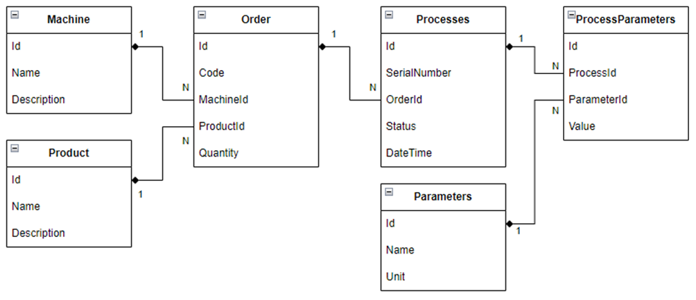

# MiniMes
Niniejszy projekt, ma na celu rozwinięcie umiejętności programistycznych w realnym kontekście biznesowym. Projekt ten skupia się na stworzeniu uproszczonej wersji systemu MES (Manufacturing Execution System), który odgrywa kluczową rolę w przemyśle produkcyjnym. Celem jest zapewnienie kompleksowego doświadczenia obejmującego zarówno backend, bazy danych jak i frontend aplikacji, co pozwoli na pełne zrozumienie i praktyczne zastosowanie zdobytej wiedzy.

Jednym z kluczowych założeń tego projektu jest nie narzucanie konkretnych rozwiązań technologicznych ani szczegółowych implementacji funkcjonalności. Dokument ten ma za zadanie dostarczyć jedynie zbiór wytycznych dotyczących mechanizmów i funkcjonalności, które powinny zostać zrealizowane w ramach systemu MES, pozostawiając jednocześnie szerokie pole do własnej interpretacji, inicjatywy i kreatywności.

## Zakres Projektu
Projekt skupi się na stworzeniu aplikacji, która:
1.	Posiada prosty interfejs użytkownika (UI), pozwalający na interakcję z systemem.
2.	Realizuje podstawowe funkcje systemu MES, takie jak tworzenie struktury i zarządzanie produkcją, monitorowanie stanu produkcji, zarządzanie zasobami, itp., w uproszczonej formie.
3.	Umożliwia przepływ informacji od punktu wejściowego (np. zamówienie produkcyjne) przez różne etapy przetwarzania, aż do zapisu w bazie danych (BD).
4.	Zachęca do stosowania najlepszych praktyk programistycznych, takich jak SOLID, DRY, KISS, itp.

## Narzędzia i Technologia
1.	Środowisko Programistyczne: Visual Studio 2022 lub JetBrains Rider lub VS Code
2.	Język Programowania: C# 12
3.	Framework: .NET 8, ASP.NET WebApi
4.	Baza Danych: MS SQL Server, SQLite lub inne, zależnie od ambicji.
5.	ORM: Entity Framework Core 
6.	Interfejs Użytkownika: Vue.js dla aplikacji webowej lub WPF dla aplikacji desktopowej.
 
## Model
Na model systemu składać się będą następujące tabele w BD:
### Maszyna 
Reprezentuje maszynę lub linię na której odbywa się produkcja
- Id: Unikalny identyfikator maszyny.
- Name: Nazwa maszyny lub linii produkcyjnej.
- Description: Opis maszyny, zawierający dodatkowe informacje, np. o jej możliwościach czy specyfikacji technicznej.
### Produkt
Reprezentuje model produktu który można wytworzyć na maszynie
- Id: Unikalny identyfikator produktu.
- Name: Nazwa produktu, który może być wyprodukowany na danej maszynie.
- Description: Opis produktu, który może zawierać specyfikacje, standardy jakości, lub informacje o wersji.
### Zlecenie
Składa się z unikalnego kodu oraz planowanej ilości do wyprodukowania jakiegoś produktu na jakiejś maszynie
- Id: Unikalny identyfikator zlecenia produkcyjnego.
- Code: Unikalny kod zlecenia, który może być wykorzystany do śledzenia produkcji.
- MachineId: Klucz obcy odnoszący się do tabeli Maszyna, identyfikujący, na której maszynie ma odbyć się produkcja.
- ProductId: Klucz obcy odnoszący się do tabeli Produkt, określający, który produkt ma być wyprodukowany.
- Quantity: Planowana ilość sztuk produktu do wyprodukowania.
### Proces
Przedstawia realizację zlecenia przez jedną sztukę produkcyjną o unikalnym numerze seryjnym, wyprodukowaną ze statusem OK/NOK w danym czasie. 
- Id: Unikalny identyfikator procesu produkcyjnego.
- SerialNumber: Unikalny numer seryjny pojedynczej sztuki produkcyjnej.
- OrderId: Klucz obcy odnoszący się do tabeli Zlecenie, wskazujący, w ramach którego zlecenia realizowany jest proces.
- Status: Status końcowy sztuki produkcyjnej, który może przyjmować wartości OK (produkt spełniający standardy) lub NOK (produkt nie spełniający standardów).
- DateTime: Data i czas wykonania lub zakończenia procesu produkcyjnego.
### Parametry
Informacja o nazwie i jednostce parametru, który można zebrać razem z procesem
- Id: Unikalny identyfikator parametru.
- Name: Nazwa parametru, który jest monitorowany lub kontrolowany w procesie produkcyjnym.
- Unit: Jednostka, w której wyrażona jest wartość parametru (np. mm, °C, itp.).
### Wartości Parametrów
Wartości zebrane w czasie dla każdego procesu
- Id: Unikalny identyfikator rekordu.
- ProcessId: Klucz obcy odnoszący się do tabeli Proces, identyfikujący proces, w ramach którego zebrane zostały dane.
- ParameterId: Klucz obcy odnoszący się do tabeli Parametry, określający, który parametr został zmierzony.
- Value: Wartość zmierzonego parametru w czasie realizacji procesu.

 
Relacje między tabelami:
- Na każdej maszynie może być wykonywanych wiele zleceń, natomiast każde zlecenie odnosi się do jednej maszyny.
- Każdy produkt może być przedmiotem wielu zleceń, ale każde zlecenie odnosi się do jednego produktu.
- Każde zlecenie może składać się z wielu procesów, ale każdy proces odnosi się do jednego zlecenia.
- Każdy proces może generować wiele wartości parametrów, a każda wartość parametru odnosi się do jednego procesu.
- Każdy parametr może być powiązany z wieloma wartościami parametrów, ale każda wartość parametru odnosi się do jednego parametru.
