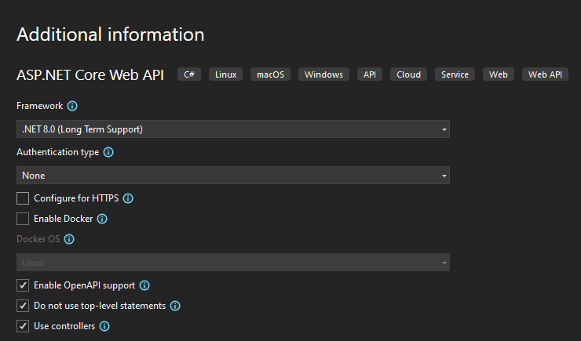

# Uworzenie projektu ASP.NET Web API

## Cel
Celem tego zadania jest stworzenie nowego projektu ASP.NET, aby rozpocząć realizację dalszych zadań.

### ASP.NET
ASP.NET jest rozbudowaną platformą do tworzenia aplikacji webowych, która jest częścią większej rodziny technologii .NET firmy Microsoft. Umożliwia tworzenie dynamicznych stron internetowych, aplikacji internetowych (Web Apps), a także usług internetowych (Web Services) przy użyciu języka programowania C#. ASP.NET charakteryzuje się wysoką wydajnością, bezpieczeństwem oraz elastycznością, oferując programistom bogaty zestaw narzędzi i bibliotek do tworzenia zaawansowanych rozwiązań.

### Web API
Typem projektu na jakim się skupimy będzie WebAPI. Web API umożliwia tworzenie RESTful API, które mogą być wykorzystywane przez aplikacje mobilne, aplikacje klienckie lub inne usługi internetowe.

## Realizacja

Realizacja zadań będzie przedstawiona w środowisku Visual Studio 2022. Po uruchomieniu środowiska, po prawej stronie zauważyć można kilka skrótów.

Wybierzmy opcję `Create a new project`.

Następnie `ASP.NET Core Web API`

Tu waśne aby odznaczyć `Configure with HTTPS`

Teraz można już stworzyć solucję i projekt naciskając przycisk `Create`

## Poruszanie się po środowisku

Po stworzeniu się projektu powinien być widoczny mniej więcej taki ekran:

Przejdźmy teraz do podstawowego narzędzia jakim jest `Solution Explorer`. Powinien być dostępny po prawej (lub lewej) stronie ekranu jako zakładka boczna. Jeśli nie widzisz takiej zakładki wpisz w górnym panelu wyszukiwania. 

Projekt sam dodaje na start kilka przykładowych klas i plików. Pozbądźmy się tych nie potrzebnych i ograniczmy się do absolutnej podstawy każdego projektu, czyli pliku `Program.cs` oraz do `appsettings.json` (przyda się później). Otwórzmy teraz plik `Program.cs`.

Jak możesz zauważyć, wygenerowany został podstawowy kod, który pozwala zainicjalizować aplikacje typu `WebApi`. Nie przejmuj się na razie co oznacza. Na tą chwilę wystarczy że będziesz wiedzieć, żeby nic przy nim nie zmieniać i że dzięki niemu budowany jest `Host` który inicjalizuje i uruchamia aplikacje.
