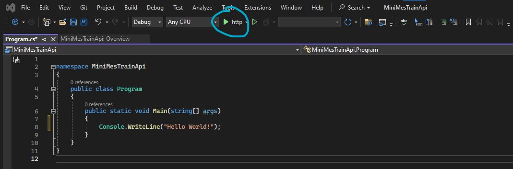
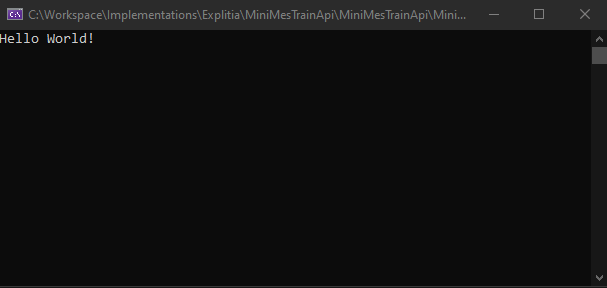
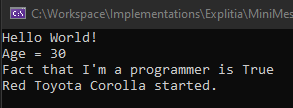
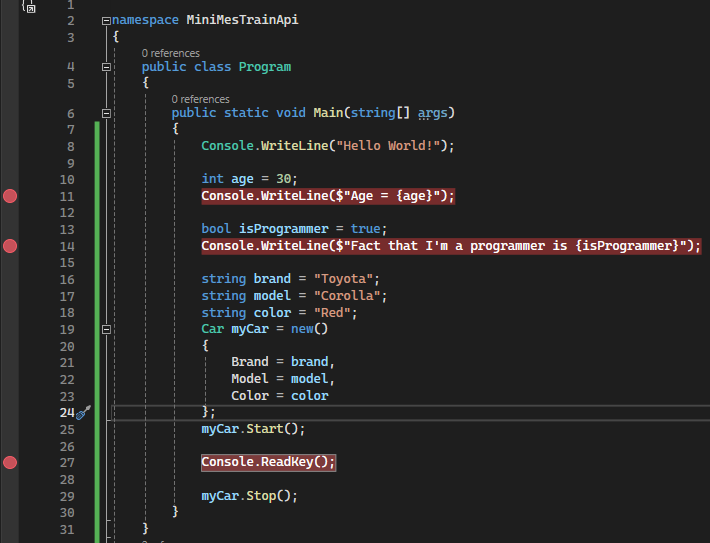
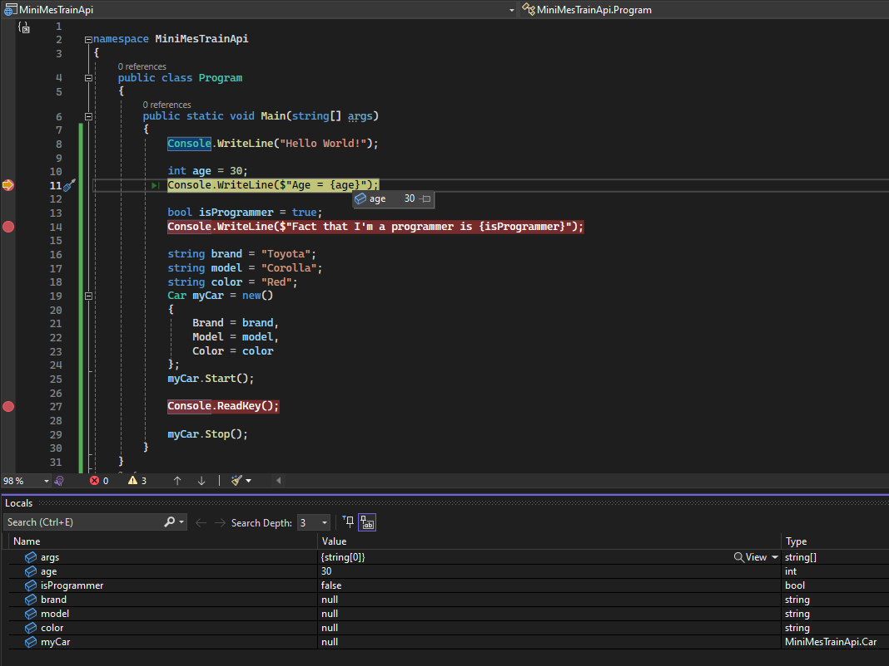
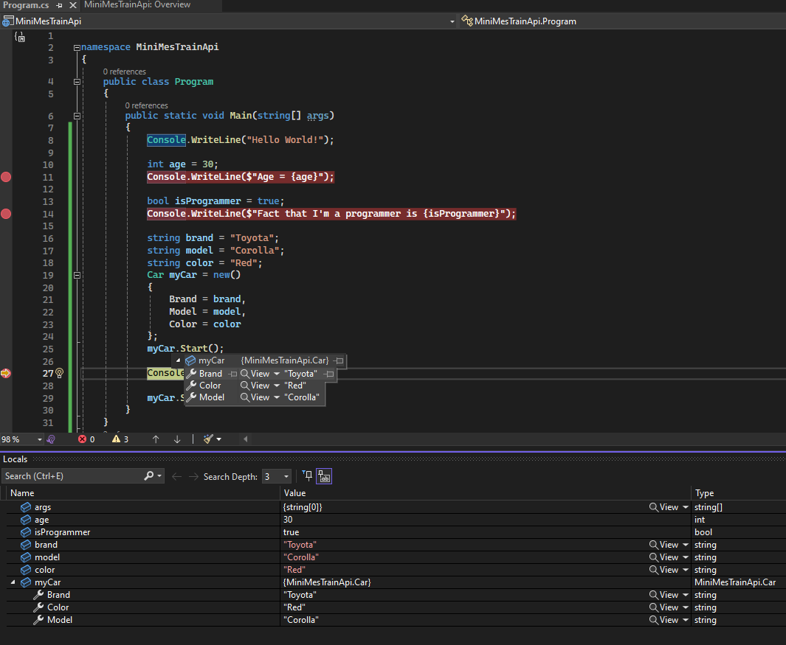

# Podstawy programowania

Nie będę tu wyjaśniał wszystkich niezbędnych pojęć programistycznych, jest od tego cała masa kursów, blogów, artykułów i filmów w sieci. Skupię się jednak na najważnieszych pojęciach, które trzeba rozumieć, żeby iść dalej.

Jeśli czujesz, że absolutne podstawy są dla Ciebie dobrze znane, pomiń ten rozdział.

## Struktura pliku.cs

W ostatnim rozdziale skończyliśmy na automatycznie wygenerowanym pliku `Program.cs`. W celu poznania absolutnych podstaw musimy jednak wyrzucić wszsytko co zostało wygenerowane (wrócimy do tego później, więc możesz sobie ten plik zapisać).

Usuń cału kod jak znajduje się w metodzie `Main()`, tak aby uzyskać taki:

```c#
namespace MiniMesTrainApi
{
    public class Program
    {
        public static void Main(string[] args)
        {

        }
    }
}
```

Zacznijmy od podstawowych pojęć w oparciu o przedstawiony kod, który jest podstawowym szkieletem aplikacji w C#:

### Namespace
namespace `MiniMesTrainApi` określa przestrzeń nazw, co jest sposobem na organizację kodu w logiczne grupy i zapobieganie konfliktom nazw. W tym przypadku, `MiniMesTrainApi` jest nazwą przestrzeni, która może zawierać klasy, interfejsy, struktury i inne przestrzenie nazw. Użycie przestrzeni nazw pomaga w utrzymaniu porządku w kodzie, szczególnie w dużych projektach.

### Klasa
`public class Program` definiuje klasę o nazwie `Program`. Klasa jest podstawową jednostką w programowaniu obiektowym i służy do tworzenia obiektów. Definiuje ona stan (w postaci pól lub właściwości) i zachowanie (w postaci metod) obiektów. Słowo kluczowe `public` oznacza, że klasa jest dostępna z zewnątrz przestrzeni nazw, w której została zdefiniowana.

### Metoda
`public static void Main(string[] args)` definiuje metodę `Main`, która jest punktem wejścia dla aplikacji konsolowej w C#. Kiedy uruchamiasz aplikację, CLR (Common Language Runtime) szuka metody Main i rozpoczyna z niej wykonanie programu.

- `public` oznacza, że metoda jest dostępna z zewnątrz klasy.
- `static` wskazuje, że metoda jest statyczna, co oznacza, że należy do samej klasy, a nie do instancji tej klasy. Dzięki temu można ją wywołać bez tworzenia obiektu klasy Program.
- `void` mówi, że metoda nie zwraca żadnej wartości.
- `(string[] args)` jest parametrem metody, który pozwala na odbieranie argumentów linii poleceń przekazanych do programu podczas uruchamiania. args to tablica ciągów (string), gdzie każdy element tablicy to jeden argument.

### Argumenty linii poleceń (args)
Argumenty linii poleceń są to dane wejściowe przekazywane do programu podczas jego uruchamiania z terminala lub wiersza poleceń. Możesz użyć tych argumentów do dostosowania działania programu bez konieczności modyfikowania kodu. Na przykład, mogą one określać ścieżki do plików do przetworzenia, opcje konfiguracyjne itp.

## Różnice między Main oraz Top-Level Statements
Co ważne przy takim podejściu jak wyżej każda aplikacja musi posiadać metodę `Main()`, aby wgl mogła zostać uruchomiona. Co prawda od wersji .Net 5 można definiować kod bez żadnej klasy i metody startowej w tzw `Top-Level Statements`, ale ja wolę podejście "oldschool'owe".

W C# istnieją dwa podejścia do pisania punktu wejścia aplikacji: tradycyjne użycie metody Main oraz stosunkowo nowe podejście znane jako `Top-Level Statements`. Oba te podejścia służą do definiowania punktu startowego programu, ale różnią się syntaktycznie i pod względem prostoty kodu dla określonych scenariuszy.

### Tradycyjna Metoda Main
Tradycyjnie, punkt wejścia do aplikacji C# jest definiowany przez statyczną metodę Main w klasie. Jest to standardowy sposób stosowany przez wiele lat, który pozwala na bardziej zorganizowaną strukturę kodu, szczególnie w większych aplikacjach. 

W tym podejściu `Main` jest metodą klasy `Program` w przestrzeni nazw `MiniMesTrainApi`, a cały kod startowy aplikacji jest umieszczony wewnątrz tej metody. Pozwala to na dodawanie dodatkowych metod, pól i innych elementów do klasy Program, jak również na strukturę z wieloma klasami i przestrzeniami nazw w ramach projektu.

### Top-Level Statements
`Top-level statements` to funkcja wprowadzona w C# 9.0, która pozwala na uproszczenie kodu aplikacji poprzez eliminację boilerplate'u związanego z definicją klasy Program i metody `Main`. Zamiast definiować metodę `Main`, możesz bezpośrednio pisać instrukcje na najwyższym poziomie pliku, które stanowią punkt wejścia aplikacji.

W tym podejściu nie ma jawnie zdefiniowanej klasy `Program` ani metody `Main`. Kompilator C# automatycznie generuje te elementy "za kulisami", umożliwiając szybkie i proste tworzenie prostych aplikacji lub skryptów. Jest to szczególnie przydatne w przypadku mniejszych projektów, gdzie tradycyjna struktura klasy Program może być nadmiarowa.

Ponieważ jesteśmy ambitni i interesują nas duże projekty zostaniemy więc przy podejściu tradycyjnym.

## Hello World!

Absolutną tradycją podczas stawiania pierwszych króków w świecie programowania jest napisanie "Hello World!" w konsoli. Niech tradycji stanie się więc zadość:

```c#
public static void Main(string[] args)
{
    Console.WriteLine("Hello World!");
}
```

Możemy teraz uruchomić naszą aplikację przez zielony trójkąt u góry ekranu. 



Zauważ że konsola na chwilę się pojawiła, ale aplikacja praktycznie odrazu się zatrzymała. Stało się tak dlatego, że napisany przez nas program dobiegł końca i aplikacja nie miała już nic więcej do zrobienia więc się zamknęła.

Kompilacja, budowanie aplikacji, i uruchamianie programu to kluczowe koncepcje w procesie tworzenia oprogramowania, które są niezbędne do zrozumienia przez początkujących programistów. Pozwól, że opiszę każde z tych pojęć krok po kroku, wykorzystując przykład prostego programu w C#.

### Kompilacja
Kompilacja to proces, w którym kod źródłowy napisany w języku programowania wysokiego poziomu (np. C#, Java, C++) jest przekształcany przez kompilator do kodu maszynowego, który jest zrozumiały dla komputera, lub do kodu pośredniego, który może być wykonany przez wirtualną maszynę. W przypadku C#, kompilator przekształca kod źródłowy do Intermediate Language (IL), który jest potem wykonywany przez środowisko uruchomieniowe .NET.

### Budowanie aplikacji
Budowanie aplikacji to szerszy proces niż kompilacja. Obejmuje on kompilację kodu źródłowego, ale także inne zadania, takie jak kopiowanie niezbędnych plików, wykonanie skryptów, które przygotowują zasoby, i pakowanie wszystkiego w gotowe do uruchomienia paczki (np. pliki .exe dla aplikacji Windows lub .jar dla aplikacji Java). W przypadku środowiska .NET, proces budowania tworzy pliki wykonywalne (.exe) lub biblioteki (.dll), które zawierają skompilowany kod IL wraz z wszelkimi zasobami potrzebnymi do uruchomienia aplikacji.

### Uruchamianie programu
Aby aplikacja się uruchomiła, system operacyjny musi załadować plik wykonywalny do pamięci, co inicjuje proces wykonania kodu przez środowisko uruchomieniowe (np. .NET Runtime dla C#). Środowisko uruchomieniowe zarządza wykonaniem aplikacji, w tym alokacją pamięci, zarządzaniem wątkami, i interakcją z systemem operacyjnym. Aplikacja wykonuje się, zaczynając od punktu wejścia, którym w przypadku aplikacji konsolowej C# jest metoda Main.

### Zatrzymanie aplikacji

Jeśli aplikacja wykona wszystkie zaprogramowane zadania (dojdzie do końca - ostatniej linijki metody `Main`) po prostu się zamknie. Nie pozwólmy jej więc na to. Możemy tego dokonać na kilka sposobów:

Nieskończona pętla:
```c#
public static void Main(string[] args)
{
    Console.WriteLine("Hello World!");
    while (true) { }
}
```
Teraz aplikacja nigdy się nie zamknie ponieważ po napisaniu `Hello World!` w konsoli, wejdzie do nieskońćzonej pętli.

Oczekiwanie na naciśnięcie klawisza:
```c#
public static void Main(string[] args)
{
    Console.WriteLine("Hello World!");
    Console.ReadKey();
}
```
Tym razem aplikacja zachowa się podobnie, ale naciśnięcie dowolnego klawisza na klawiaturze spowoduje przerwanie oczekiwania i aplikacja się zamknie. Spróbuj uruchomić aplikację.


## Podstawowe pojęcia

Klasa
Klasa w programowaniu to sposób na zdefiniowanie nowego typu danych. Można ją postrzegać jako szablon lub plan, według którego tworzone są obiekty. Klasa definiuje stan (dane, właściwości) i zachowanie (metody, funkcje) tego, co będzie reprezentować. Na przykład, możesz mieć klasę Samochod, która przechowuje informacje o marce, modelu i kolorze samochodu oraz ma metody do uruchamiania samochodu i zatrzymywania go.
```c#
public class Car
{
    public string Brand { get; set; }
    public string Model { get; set; }
    public string Color { get; set; }

    public void Start()
    {
        Console.WriteLine($"{Color} {Brand} {Model} started.");
    }

    public void Stop()
    {
        Console.WriteLine($"{Color} {Brand} {Model}  stopped.");
    }
}
```
### Metoda
Metoda to blok kodu, który wykonuje określoną czynność. Metody mogą przyjmować dane wejściowe (parametry), przetwarzać te dane i opcjonalnie zwracać wynik. W kontekście klasy, metody definiują zachowanie obiektów tej klasy. Na przykład, metoda Uruchom w klasie Samochod może wyświetlać komunikat o uruchomieniu samochodu.

### Zmienna
Zmienna to nazwane miejsce w pamięci, które przechowuje wartość danych. Każda zmienna ma określony typ, który determinuje rodzaj danych, jakie może przechowywać, np. liczby, tekst, czy obiekty klas.

```c#
int age = 30;
bool isProgrammer = true;
Car myCar = new();
```
### Typy zmiennych
W językach programowania, takich jak C#, istnieją różne typy zmiennych:

- Typy proste (wbudowane): np. int (liczby całkowite), double (liczby zmiennoprzecinkowe), char (pojedyncze znaki), bool (wartości logiczne prawda/fałsz).
- Typy złożone: np. string (łańcuchy znaków), tablice (int[], string[]), oraz klasy (Car).

## Property vs Field
W C# property (właściwość) i field (pole) to dwa różne koncepty używane do przechowywania danych w klasie, ale mają różne zastosowania i charakterystyki.

### Field (Pole):
- Pole to zmienna zdefiniowana bezpośrednio w klasie.
- Pola są zazwyczaj używane do przechowywania danych, które konsumowane są przez metody tej klasy lub przez inne klasy.
- Pola mogą być publiczne, chronione, prywatne lub z ograniczeniem dostępu internal, zależnie od wymaganego poziomu enkapsulacji.
- Zazwyczaj pola są prywatne i służą jako wewnętrzny stan obiektu.
- Pola nie zapewniają dodatkowej logiki przetwarzania danych; służą jako pojemnik na dane.
### Property (Właściwość):
- Właściwość w C# jest jak metoda, ale używasz jej jak pola.
- Właściwości posiadają get i set akcesory, które kontrolują dostęp do wartości. Dzięki temu można dodać dodatkową logikę przy ustawianiu lub odbieraniu wartości.
- get akcesor jest używany do odczytania wartości właściwości, a set do jej zapisania.
- Właściwości są często publiczne i służą do udostępniania i ochrony stanu obiektu.
- Właściwości mogą być odczytane (read-only), zapisane (write-only) lub odczytywane i zapisywane (read-write), w zależności od tego, czy zdefiniowane są akcesory get i set.

Oto przykładowy kod pokazujący pole (field) i właściwość (property):

```c#
public class User
{
    // Field
    private string name; 

    // Property
    public string Name
    {
        get { return name; }
        set { name = value; }
    }
}
```

### Różnice:
1. Enkapsulacja: Właściwości zapewniają wyższy poziom enkapsulacji. Dzięki akcesorom get i set możesz kontrolować, jak wartość jest otrzymywana i ustawiana, a nawet wykonywać walidację.

1. Logika biznesowa: Właściwości mogą zawierać logikę biznesową, która jest wykonywana, gdy wartość jest odczytywana lub zapisywana. Pola takiej możliwości nie posiadają.

1. Data Binding: Właściwości są używane w mechanizmach wiązania danych (data binding), które są powszechne w programowaniu GUI. Pola nie są zwykle używane w wiązaniu danych.

1. Serializacja: Wiele mechanizmów serializacji wymaga, aby dane były udostępniane przez właściwości, nie pola.

### Testy

Spróbuj teraz pobawić się zmiennymi, klasami i metodami. Przykładowy kod w całości wygląda następująco:

```c#
namespace MiniMesTrainApi
{
    public class Program
    {
        public static void Main(string[] args)
        {
            Console.WriteLine("Hello World!");

            int age = 30;
            Console.WriteLine($"Age = {age}");

            bool isProgrammer = true;
            Console.WriteLine($"Fact that I'm a programmer is {isProgrammer}");

            string brand = "Toyota";
            string model = "Corolla";
            string color = "Red";
            Car myCar = new()
            {
                Brand = brand,
                Model = model,
                Color = color
            };
            myCar.Start();

            Console.ReadKey();

            myCar.Stop();
        }
    }
    public class Car
    {
        public string Brand { get; set; }
        public string Model { get; set; }
        public string Color { get; set; }

        public void Start()
        {
            Console.WriteLine($"{Color} {Brand} {Model} started.");
        }

        public void Stop()
        {
            Console.WriteLine($"{Color} {Brand} {Model}  stopped.");
        }
    }
}
```


## Garść dobrych praktyk

1. Nazwy klas, metod i właściowści (properties) piszemy z wielkiej litery
1. Nazwy zmiennych (field) piszemy z małej litery.
1. Nazwy jakigokolwiek elementu w kodzie piszemy w języku angielskim, o ile nie chcemy w społeczności progamistów wystawiać się na pośmiewisko.
1. Zmienne typu `bool` (True/False) zazwyczaj powinny zaczynać się od `is`, albo innego spójnika sugertrującego pytanie na które dana zmienna odpowiada, pytania na które odpowiedź jest tak lub nie.
1. String można w łatwy sposób budować poprzedzając cudzysłów znakiem `$` dzięki czemu w klamrach można podawać zmienne `{variable}` 
1. Tworzenie nowego obiektu klasy można przyspieszyć poprzez podanie w klamrach jego właściwości.

## Debugowanie

Debugowanie to proces identyfikowania i usuwania błędów (nazywanych także "bugami") z kodu programu. Jest to kluczowy etap w cyklu życia oprogramowania, niezbędny do zapewnienia, że aplikacja działa poprawnie i zgodnie z oczekiwaniami. 

Do debugowania często używa się specjalnych narzędzi, które umożliwiają programiście krok po kroku przejść przez wykonanie programu, inspekcję zmiennych, a także ustawić "punkty przerwania" (breakpoints), gdzie wykonanie programu zostanie zatrzymane, aby można było zbadać stan aplikacji w danym momencie. 

Aby tego dokonać, po lewej stronie od naszego kodu ustawić można czerwone kropki - breakpointy.



Sprawią one, że jeśli aplikacja zostanie uruchomiona w trybie debugowania, program zatrzyma się dokładnie na tej linijce wskazanej przez breakpoint, dając możliwość na przykład inspekcji zmiennych.



Inspekcji zmiennych można dokonać poprzez najechanie na zmienną w kodzie (pojawi się rozwijalny dialog) lub na panelu `Locals` dostępnym najczęśniej w dolnym pasku zakładek lub po wyszukaniu w wyszukiwarce u góry.



Obiekty klas można rozwijać i mieć dostęp do wszystkich właściwości z osobna

## Struktury danych
### Array (Tablica):

- Jest to podstawowa struktura danych w C#, która przechowuje elementy tego samego typu w kontigualnym bloku pamięci.
- Rozmiar tablicy jest ustalany przy jej tworzeniu i nie może być zmieniany (tablice są statyczne).
- Dostęp do elementów tablicy jest bardzo szybki, ponieważ są one przechowywane w sposób uporządkowany w pamięci.
### List:

- Jest to dynamiczna struktura danych dostarczana przez .NET Framework w postaci generycznej klasy List<T>.
- Lista może zmieniać swój rozmiar dynamicznie, można dodawać i usuwać elementy bez konieczności redefiniowania struktury (listy są dynamiczne).
- Lista oferuje metody, które ułatwiają pracę z kolekcjami, takie jak Add, Remove, Find itp.

Przykładowo:
```c#
var array = new int[5]; // Tablica o stałym rozmiarze
var list = new List<int>(); // Lista o dynamicznym rozmiarze
```

Listy obiektów pozwalają na przechowywanie i zarządzanie kolekcjami obiektów. Główne zalety używania list zamiast tablic obejmują:

- Elastyczność: Listy są bardziej elastyczne, ponieważ możesz dodawać i usuwać elementy w trakcie działania programu.
- Funkcjonalność: Listy dostarczają szereg pomocnych metod, które ułatwiają manipulowanie kolekcjami danych.
- Bezpieczeństwo typów: Zarówno listy, jak i tablice są bezpieczne typowo, ale listy pozwalają na łatwiejsze wykonywanie operacji bez konieczności manualnego zarządzania rozmiarem kolekcji.

Dlatego, choć tablice są szybsze i mniej obciążające dla pamięci, to listy są często preferowanym wyborem, gdy potrzebujemy większej elastyczności i wygodniejszego interfejsu do zarządzania kolekcjami danych.