# REST API - Podstawy

Wróćmy teraz do podstawowej aplikacji, którą na początku utworzyliśmy. Projekt powinien składać się tylko z jednego pliku `Program.cs` oraz ewentualnie z pliku `appsettings.json`. Plik `Program.cs` powinien mieć następującą zawartość:

```c#
namespace MiniMesTrainApi
{
    public class Program
    {
        public static void Main(string[] args)
        {
            var builder = WebApplication.CreateBuilder(args);

            // Add services to the container.

            builder.Services.AddControllers();
            // Learn more about configuring Swagger/OpenAPI at https://aka.ms/aspnetcore/swashbuckle
            builder.Services.AddEndpointsApiExplorer();
            builder.Services.AddSwaggerGen();

            var app = builder.Build();

            // Configure the HTTP request pipeline.
            if (app.Environment.IsDevelopment())
            {
                app.UseSwagger();
                app.UseSwaggerUI();
            }

            app.UseAuthorization();

            app.MapControllers();

            app.Run();
        }
    }
}

```

Dalej możemy się jeszcze nie przejmować co oznacza ten kod. Narazie ważne, że sprawia on że nasza aplikacja ASP.NET może wystartować, budując niezbędne mechanizmy.

### Uruchomienie aplikacji ASP.NET

Spróbuj uruchomić teraz aplikację. Wysoce prawdopodne że domyśłnie skonfigurowana jest strona startowa naszej aplikacji webowej jako strona ze Swaggerem. Powinna ona automatycznie zostać otworzona przez przeglądarkę zaraz po starcie aplikacji. 

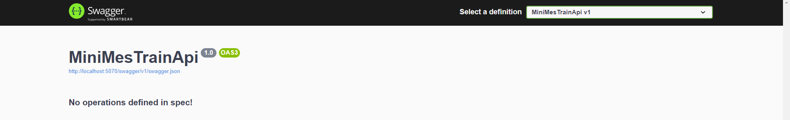

Jeśli tak się nie stało, zauważ, że na pewno wystartowała aplikacja w zwykłej konsoli.

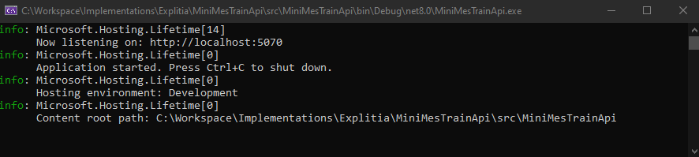

W konsoli został wypisany log z informacją na jakim adresie URL oraz porcie możemy znaleźć naszą aplikację WEB. W moim przypadku jest to http://localhost:5070. `Uwaga!` Port jest wybierany losowo z dostępnych, więc u każdego port może się różnić. Aby przejść do podglądu Swaggera, wystarczy dopisać do naszego adresu: http://localhost:5070/swagger/index.html.

## Swagger 

Swagger to zestaw narzędzi open-source służący do projektowania, budowania, dokumentowania oraz używania interfejsów API REST. Umożliwia on szybkie tworzenie interaktywnej dokumentacji API, generowanie kodu klienta w wielu językach oraz testowanie interfejsów API bezpośrednio z przeglądarki. Swagger jest szeroko stosowany ze względu na swoją elastyczność i wszechstronność, pomagając zarówno deweloperom backendowym, jak i frontendowym w efektywniejszej pracy nad API.

Zauważ, że Swagger wypisał nam że nie zdefiniowaliśmy jeszcze żadnej operacji. Spróbujmy więc to zmienić.

## Kontroler

Jednym z mechanizmów, które dostarcza nam aplikacja ASP.NET są kontrolery. Kontroler w ASP.NET Core jest klasą, która obsługuje żądania przychodzące do aplikacji. Kontrolery są zorganizowane w metody, które odpowiadają za obsługę konkretnych operacji na zasobach. Każda metoda w kontrolerze może być powiązana z jednym lub więcej endpointami, definiując logikę obsługi dla różnych typów żądań HTTP.

### Endpoint

Endpoint to konkretny punkt w API, który można wywołać przy użyciu określonego adresu URL i metody HTTP. Endpointy odpowiadają za wykonanie określonych akcji, takich jak pobieranie danych, ich modyfikacja, dodawanie nowych zasobów czy ich usuwanie.

### Stwórzmy kontroler

Stwórzmy więc nasz pierwszy kontroler, który pozwoli nam na wykonanie jakiejś operacji w aplikacji. Aby to zrobić dodajmy folder do projektu i nazwijmy go `Controllers`.

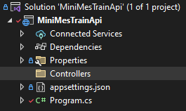

Dodajmy teraz plik `GreetingController.cs` do folderu.

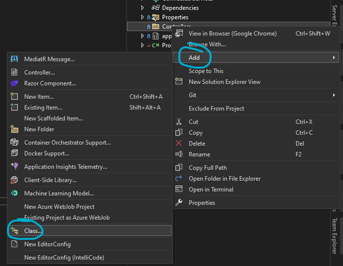

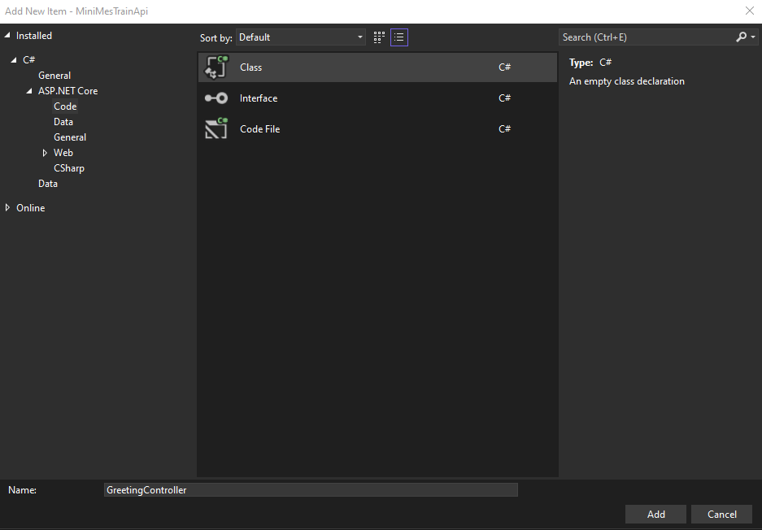

Powinno to teraz wyglądać mniej więcej tak:

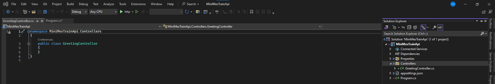

Napiszmy teraz taki kod:

```c#
using Microsoft.AspNetCore.Mvc;

namespace MiniMesTrainApi.Controllers
{
    [Route("greeting")]
    public class GreetingController : Controller
    {
        [HttpGet]
        [Route("hello")]
        public IActionResult HelloWorld()
        {
            string message = "HelloWorld!";
            Console.WriteLine(message);
            return Ok(message);
        }
    }
}
```

### Dyrektywa 'using'

```c#
using Microsoft.AspNetCore.Mvc;
```

Ta linijka wskazuje, że w kodzie zostanie użyta przestrzeń nazw Microsoft.AspNetCore.Mvc, która zawiera klasy i atrybuty niezbędne do tworzenia kontrolerów i akcji w ASP.NET Core MVC lub Web API.

### Namespace

```c#
namespace MiniMesTrainApi.Controllers
{
    ...
}
```
Definiuje przestrzeń nazw MiniMesTrainApi.Controllers, która organizuje kontrolery w aplikacji. To konwencja ułatwiająca zarządzanie kodem w większych projektach.
### Atrybut Route
```c#
[Route("greeting")]
```
Ten atrybut aplikowany do klasy kontrolera określa bazowy adres URL dla wszystkich akcji wewnątrz tego kontrolera. W tym przypadku bazowy adres URL to /greeting.
### Deklaracja Kontrolera
```c#
public class GreetingController : Controller
```
Deklaruje klasę GreetingController, która dziedziczy po klasie Controller. Dziedziczenie z Controller oznacza, że klasa może obsługiwać żądania HTTP i zawierać akcje kontrolera.
### Atrybuty Akcji
```c#
[HttpGet]
[Route("hello")]
```
- `[HttpGet]` oznacza, że akcja HelloWorld obsługuje żądania HTTP GET.
- `[Route("hello")]` definiuje adres URL akcji. Biorąc pod uwagę bazowy adres URL kontrolera, pełny adres URL do tej akcji to `/greeting/hello`.
### Metoda Akcji
```c#
public IActionResult HelloWorld()
{
    ...
}
```
Jest to metoda akcji HelloWorld, która obsługuje żądania HTTP zgodnie z zdefiniowanym typem żądania (HttpGet) i ścieżką (/greeting/hello). Metoda zwraca `IActionResult`, co umożliwia zwracanie różnych typów odpowiedzi HTTP.
### Logika Akcji
```c#
string message = "HelloWorld!";
Console.WriteLine(message);
return Ok(message);
```
Wewnątrz metody akcji:

Tworzona jest zmienna message zawierająca ciąg znaków "HelloWorld!".
Za pomocą `Console.WriteLine(message);` wiadomość jest wypisywana na konsoli serwera.
`return Ok(message);` zwraca odpowiedź HTTP 200 (OK) z treścią zawierającą przekazaną wiadomość. Metoda Ok() jest skrótem umożliwiającym łatwe zwracanie sukcesu operacji wraz z danymi.

## Test nowego kontrolera

Uruchom teraz aplikację i spójrz na Swagger UI.
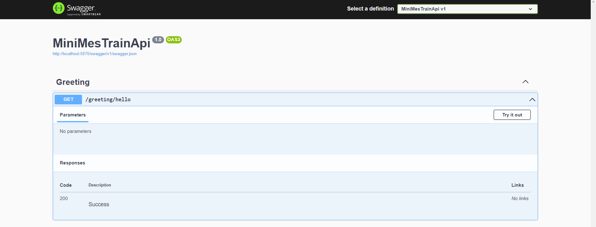

Do automatycznej dokumentacji API został dodany pierwszy endpoint. Rozwiń go przyciskiem po prawej i kliknij `Try it out`. a następnie `Execute`.

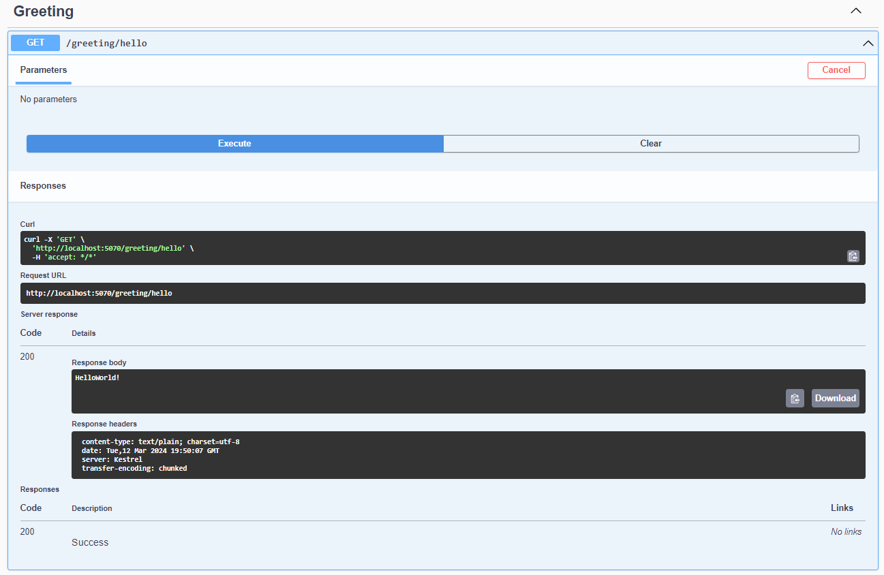

Wykonanie testowego żądania HTTP typu GET do endpointu API o ścieżce `/greeting/hello`:

1. Skonfigurowaliśmy Swagger UI do wykonania żądania HTTP GET do określonego endpointu.
1. Swagger UI wygenerował odpowiednią komendę cURL, która może być użyta w terminalu lub skrypcie do symulacji żądania: curl -X 'GET' 'http://localhost:5070/greeting/hello' -H 'accept: */*'.
1. Opcja -X 'GET' wskazuje na typ żądania HTTP, czyli GET.
1. Adres URL http://localhost:5070/greeting/hello jest miejscem docelowym żądania.
1. Opcja -H 'accept: */*' definiuje nagłówek HTTP Accept, w tym przypadku mówiący o tym, że klient może otrzymać odpowiedź w dowolnym formacie.
1. Swagger UI wysłał żądanie do aplikacji działającej lokalnie na porcie 5070.
1. Serwer odpowiedział z kodem stanu HTTP 200, co oznacza, że żądanie zostało pomyślnie obsłużone i zwróciło dane.
1. W ciele odpowiedzi (Response body) wyświetlony został tekst `helloWorld!`, który jest odpowiedzią zdefiniowaną przez aplikację dla tego konkretnego endpointu.

### Request z URL przeglądarki

Skopiuj teraz całą ścieżkę naszego endpointa. W moim przypadku jest to http://localhost:5070/greeting/hello (Zwróć uwagę na port). Wklej ją teraz jako link do wyszkiwarki w przeglądarce.

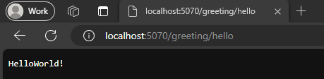

Spójrz na konsolę aplikacji. Powinienś widzieć tam przynajmniej dwa pozdrowienia. Odśwież teraz kartę przeglądarki i zauważ co się dzieje w konsoli. Daj breakpoint w kodzie w metodzie naszego kontrolera i odśwież ponownie przeglądarkę lub wyśli request w Swagger UI.

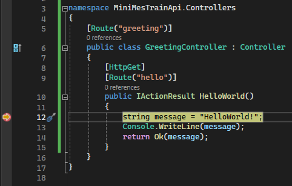

Uzyskaliśmy w ten sposób możliwość wysyłania żądań do naszej aplikacji z zewnętrznych źródeł w relacji `Client - Serwer`.

### Dev Tools przeglądarki

Będąc na karcie ze Swagger UI lub tej z bezpośrednim requestem w URL, kliknij F12 na klawiaturze, co otworzy DevTools'y, czyli niezbędnik każdego programisty, który ma jakąkolwiek styczność z aplikacjami WEB.

Wejdź w zakładkę `Networks`, gdzie możesz podejrzeć wszelkie żądania jakie wysyłane są przez aplikację WEB do API.

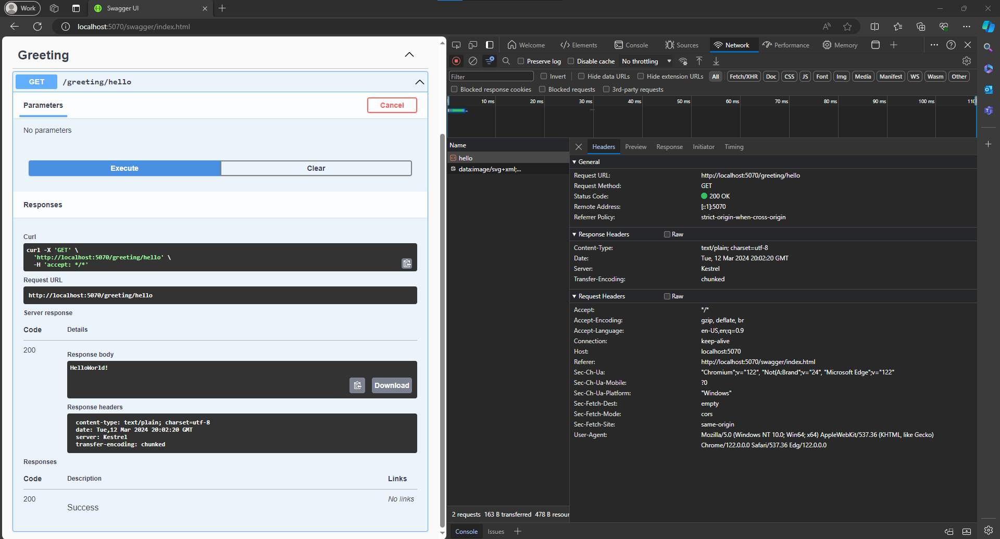

Nie inaczej jest z naszym requestem który wysyłąmy za każdym kliknięciem w `Execute`. Możesz teraz przejrzeć zawartość requesta przechodząc przez kolejne zakłądki. Np w 'Response' znajdziesz treść odpowiedzi naszego API.

### Typy metod HTTP

W naszym pierwszym endpoincie użyliśmy metody HTTP - GET. Pora poznać pozostałe:

- GET: Żądanie pobrania danych z określonego zasobu. GET jest bezpieczną metodą, co oznacza, że nie powoduje zmian w stanie zasobu.
- POST: Żądanie dodania nowego zasobu lub przesłania danych do serwera. POST może zmienić stan serwera lub zasobu.
- PUT: Żądanie aktualizacji istniejącego zasobu. PUT zastępuje obecny zasób danymi przesłanymi w żądaniu.
- DELETE: Żądanie usunięcia określonego zasobu.

### Ścieżka / Adres URL

Aby dostać się do naszego endpointu użyliśmy konkretnej ścieżki URL

Ścieżka to część adresu URL, która wskazuje na konkretny zasób lub operację w API. Składa się z różnych segmentów oddzielonych ukośnikami (/), które mogą reprezentować zarówno konkretne zasoby, jak i operacje na nich. Przykład: /users/123/orders wskazuje na zasoby zamówień dla użytkownika o identyfikatorze 123.

### Argumenty `[FromQuery]`

Nasz endpoint aktualnie nie posiada żadnych argumentów. Zmieńmy to dopisując teraz do naszego kodu:

```c#
using Microsoft.AspNetCore.Mvc;

namespace MiniMesTrainApi.Controllers
{
    [Route("greeting")]
    public class GreetingController : Controller
    {
        [HttpGet]
        [Route("hello")]
        public IActionResult Hello([FromQuery] string name)
        {
            string message = $"Hello {name}";
            Console.WriteLine(message);
            return Ok(message);
        }
    }
}
```

Przeładujmy aplikacje i spójrzmy na Swaggera (jego również wypadałoby odświeżyć):

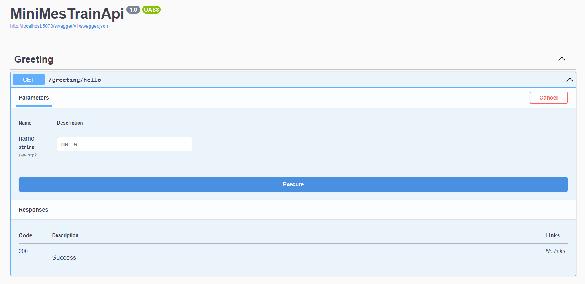

Pojawił się nowy input do którego możemy wpisać nasz argument `FromQuery` wpisz swoje imię i kliknij `Execute`:
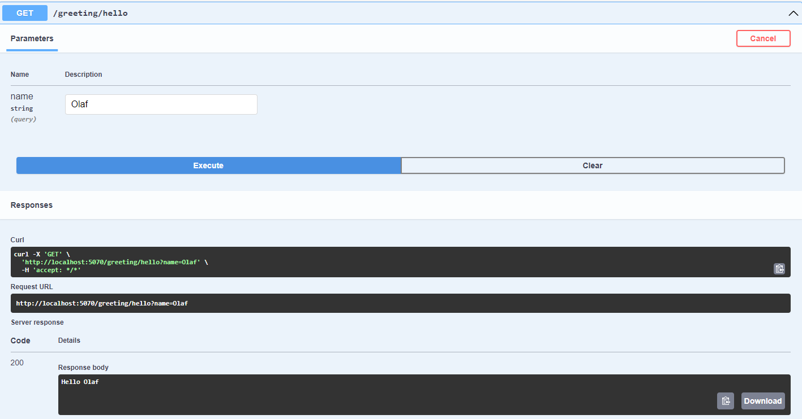

Możesz również przedebugować program i zobaczyć że argument, który wpisujemy `FromQuery` trafia faktycznie do naszego endpointa.

Spróbuj teraz ten sam efekt uzyskać wpisując bezpośredni link do wyszukiwarki. W moim przypadku bedzie to: http://localhost:5070/greeting/hello?name=Olaf
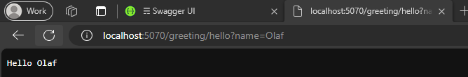


### Argumenty `[FromRoute]`

Spróbujmy uzyskać ten efekt ale korzystając z atrybutu `[FromRoute]`:


```c#
using Microsoft.AspNetCore.Mvc;

namespace MiniMesTrainApi.Controllers
{
    [Route("greeting")]
    public class GreetingController : Controller
    {
        [HttpGet]
        [Route("hello/{name}")]
        public IActionResult Hello([FromRoute] string name)
        {
            string message = $"Hello {name}";
            Console.WriteLine(message);
            return Ok(message);
        }
    }
}
```

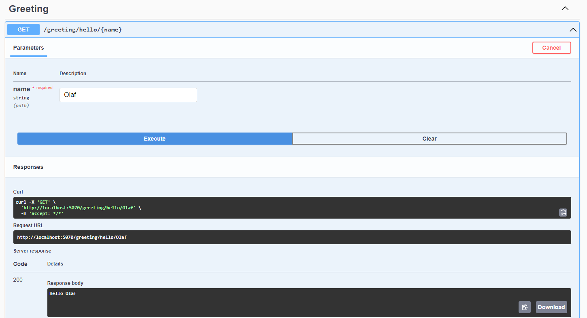

Na pierwszy rzut oka nie ma większej różnicy. Spójrz jednak teraz na URL jaki możemy wysłać w żądaniu i porównaj go z wcześniejszym 

[FromQuery] -> http://localhost:5070/greeting/hello?name=Olaf

[FromBody] -> http://localhost:5070/greeting/hello/Olaf

### Typy wprowadzania argumentów:
- `FromQuery`: Wartości parametrów są przekazywane w URL jako parametry zapytania (query string). Przykład: ?userid=123.
- `FromRoute`: Parametry są częścią URL, zazwyczaj określone jako część ścieżki. Na przykład, w /users/{userId}, {userId} jest parametrem z trasy.
- `FromBody`: Oznacza, że dane przesłane w ciele żądania (request body) powinny zostać zmapowane na parametry metody kontrolera. Stosowane głównie dla metod POST i PUT, gdzie ciało zawiera dane do przetworzenia.
- `FromHeader`: Wartości parametrów są przekazywane w nagłówkach HTTP żądania.
- `FromForm`: Wartości parametrów są przekazywane w formularzu, który jest częścią ciała żądania, typowo używane w żądaniach POST z danymi formularza.


### Kolejne endpointy

Stworzyłem kilka przykładowych endpointów. Możesz je wypróbować, przedebugować i zrozumieć jak działają:

```c#
using Microsoft.AspNetCore.Mvc;

namespace MiniMesTrainApi.Controllers
{
    [Route("greeting")]
    public class GreetingController : Controller
    {
        [HttpGet]
        [Route("hello/{name}")]
        public IActionResult HelloWorld([FromRoute] string name)
        {
            string message = $"Hello {name}";
            Console.WriteLine(message);
            return Ok(message);
        }

        [HttpGet]
        [Route("car")]
        public IActionResult GetCar()
        {
            string brand = "Toyota";
            string model = "Corolla";
            string color = "Red";
            Car myCar = new()
            {
                Brand = brand,
                Model = model,
                Color = color
            };
            return Ok(myCar);
        }

        [HttpPost]
        [Route("start")]
        public IActionResult StartCar([FromBody] Car car)
        {
            var message = car.Start();
            return Ok(message);
        }

        [HttpPut]
        [Route("paint")]
        public IActionResult Paint([FromBody] Car car, [FromQuery] string color)
        {
            var message = car.Paint(color);
            return Ok(message);
        }

        [HttpDelete]
        [Route("crash")]
        public IActionResult Crash([FromBody] Car car)
        {
            var message = car.Crash();
            return Ok(message);
        }
    }

    public class Car
    {
        public string Brand { get; set; }
        public string Model { get; set; }
        public string Color { get; set; }

        public string Start()
        {
            var message = $"{Color} {Brand} {Model} drove away.";
            Console.WriteLine(message);
            return message;
        }

        public string Paint(string newColor)
        {
            var message = $"{Color} {Brand} {Model} was repainted {newColor}.";
            Color = newColor;
            Console.WriteLine(message);
            return message;
        }

        public string Crash()
        {
            var message = $"{Color} {Brand} {Model} crashed!";
            Console.WriteLine(message);
            return message;
        }
    }
}
```

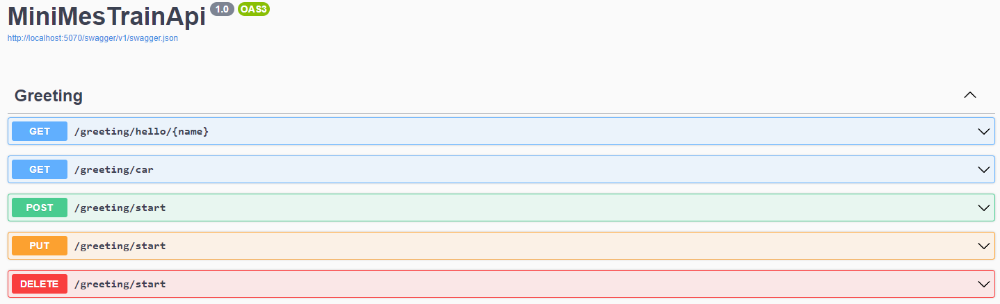

Stwórz teraz własne endpointy i kolejny kontroler i przećwicz zdobytą wiedzę realizując poniższe zadanie:

# Zadanie: "System zarządzania biblioteką"
Celem tego zadania jest stworzenie kontrolera w ramach aplikacji ASP.NET Core, który umożliwia zarządzanie prostą biblioteką książek. Aplikacja pozwala na dodawanie, aktualizowanie, usuwanie i przeglądanie dostępnych książek, a także na wypożyczanie i zwracanie książek przez użytkowników.

## Opis funkcjonalności:
- Lista książek: Endpoint do pobierania listy wszystkich dostępnych książek.
- Szczegóły książki: Endpoint do pobierania szczegółów o konkretnej książce.
- Dodawanie książki: Endpoint do dodawania nowych książek do biblioteki.
- Aktualizacja książki: Endpoint do aktualizowania danych istniejącej książki.
- Usuwanie książki: Endpoint do usuwania książki z biblioteki.
Wypożyczenie książki: Endpoint do wypożyczania książki przez użytkownika.
- Zwracanie książki: Endpoint do zwracania wypożyczonej książki.
## Wymagania techniczne:
- Utwórz nowy kontroler o nazwie LibraryController.
- Utwórz klasy Book i User, które reprezentują odpowiednio książkę i użytkownika w systemie bibliotecznym.
- Książki i użytkownicy powinni być przechowywani w statycznych listach w ramach kontrolera.
## Zadania:
### Kontroler:

- Utwórz kontroler LibraryController z odpowiednim atrybutem Route.
- Zdefiniuj statyczne listy książek i użytkowników, które będą służyć jako baza danych.
### Klasy:

- Utwórz klasę Book zawierającą właściwości takie jak Id, Title, Author, IsAvailable itp.
- Utwórz klasę User zawierającą Id, Name i inną niezbędną informację.
### Endpointy:

- Implementacja metod HTTP odpowiedzialnych za CRUD (Create, Read, Update, Delete) dla książek.
- Implementacja metod pozwalających na wypożyczenie i zwrócenie książki, z odpowiednimi kontrolami stanu książki.

## Wskazówki:
- Pomyśl o wykorzystaniu odpowiednich statusów HTTP dla różnych scenariuszy (np. 404 NotFound, 201 Created, 400 BadRequest).
- Zapewnij walidację danych wejściowych (np. czy string nie ma znaków specjalnych lub czy nie jest pusty)
- Przemyśl, jak możesz obsłużyć relacje między książkami a użytkownikami (np. którzy użytkownicy wypożyczyli które książki).
- Aby zapewnić najprostrzą persystencję wykorzystaj po prostu klasę statyczną do przechowywania list obiektów.