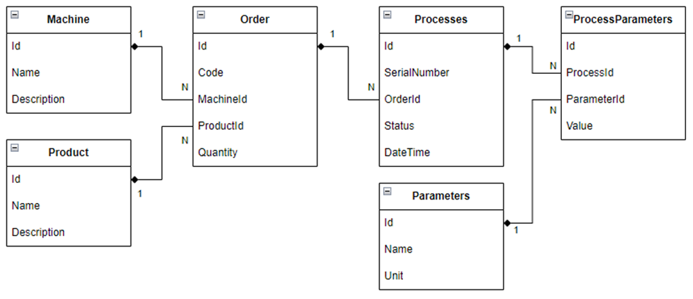
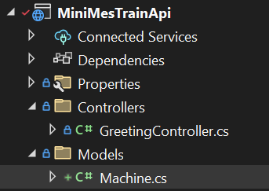
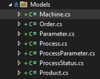

# Modelowanie Bazy Danych

Zajmijmy się teraz zamodelowaniem tabel BD. Modelowanie tabel w bazie danych za pomocą klas, zwanych encjami, w kontekście Object-Relational Mapping (ORM) polega na reprezentowaniu struktury tabel bazodanowych jako klasy w języku programowania, w tym przypadku C#. ORM, jak Entity Framework w .NET, zapewnia mapowanie pomiędzy obiektami w kodzie a rekordami w bazie danych.

Każda encja (Entity) w kodzie jest zwykle odzwierciedleniem tabeli w bazie danych. Właściwości lub atrybuty klasy reprezentują kolumny tabeli, a instancje klasy odpowiadają wierszom w tabeli. To pozwala programistom pracować z bazą danych w bardziej obiektowy sposób, eliminując potrzebę pisania zapytań SQL dla podstawowych operacji na danych.

## Przykład:
Załóżmy, że mamy tabelę Users w bazie danych z kolumnami Id, Name i Email. Modelowanie tej tabeli za pomocą klasy w C# wyglądałoby mniej więcej tak:

``` c#
public class User
{
    public int Id { get; set; } // kolumna Id tabeli Users
    public string Name { get; set; } // kolumna Name tabeli Users
    public string Email { get; set; } // kolumna Email tabeli Users
}
```

Gdy używamy ORM, nie musimy bezpośrednio pisać zapytań SQL, aby na przykład dodać nowego użytkownika do tabeli. Zamiast tego tworzymy nowy obiekt klasy User i wykorzystujemy metody ORM do zapisania tego obiektu w bazie danych:

```c#
User newUser = new User { Name = "Jan Kowalski", Email = "jan.kowalski@example.com" };
dbContext.Users.Add(newUser);
dbContext.SaveChanges();
```

W powyższym kodzie dbContext reprezentuje sesję z bazą danych, a Users jest kolekcją odpowiadającą tabeli Users. ORM tłumaczy operacje na tej kolekcji na odpowiednie zapytania SQL, które są wykonywane na bazie danych. Metoda SaveChanges powoduje wykonanie transakcji w bazie danych.

## Zalety użycia ORM:
Abstrakcja: ORM zapewnia abstrakcję od niskopoziomowych zapytań SQL, co ułatwia pracę programistom, szczególnie tym, którzy nie są ekspertami od baz danych.
Produktywność: Programiści mogą szybciej tworzyć i modyfikować schematy baz danych, ponieważ wiele operacji zarządzania danymi jest automatyzowanych.
Bezpieczeństwo: ORM często oferuje ochronę przed typowymi zagrożeniami, jak SQL injection.
Utrzymanie: Zmiany w strukturze bazy danych często można przeprowadzać bez konieczności znaczącej modyfikacji kodu aplikacji.
## Wady użycia ORM:
Wydajność: Automatycznie generowane zapytania SQL nie zawsze są optymalizowane pod kątem wydajności.
Złożoność: Bardzo skomplikowane zapytania i operacje mogą być trudniejsze do wyrażenia i zarządzania przy użyciu ORM.
Kontrola: Programiści mogą czuć mniejszą kontrolę nad dokładnym zachowaniem zapytań bazodanowych.

## Modelowanie MiniProduction

Przypomnijmy sobie diagram tabel jaki musimy zamodelować:



Zacznijmy od tabeli `Machine`. Stwórzmy nowy folder i nazwijmy go `Models`. Dodajmy nową klasę:



Stwórzmy reprezentujące kolumny właściwości:

```c#
public class Machine
{
    public int Id { get; set; }
    public string Name { get; set; } = "";
    public string? Description { get; set; }
}
```

Analogicznie dodajmy `Product` 

```c#
public class Product
{
    public int Id { get; set; }
    public string Name { get; set; } = "";
    public string? Description { get; set; }
}

```

oraz `Order`

```c#
public class Order
{
    public long Id { get; set; }
    public string Code { get; set; } = "";
    public int MachineId { get; set; }
    public int ProductId { get; set; }
    public int Quantity { get; set; }
}
```

Zauważmy jednak, że zlecenie posiada relacje w stosunkui jeden do wielu do maszyn i produktów. Aby zrealizować relację między tabelami, wprowadźmy odpowiednie property jak poniżej:


```c#
public class Machine
{
    public int Id { get; set; }
    public string Name { get; set; } = "";
    public string? Description { get; set; }

    public ICollection<Order> Orders { get; set; } = null!;
}

public class Product
{
    public int Id { get; set; }
    public string Name { get; set; } = "";
    public string? Description { get; set; }

    public ICollection<Order> Orders { get; set; } = null!;
}

public class Order
{
    public long Id { get; set; }
    public string Code { get; set; } = "";
    public int MachineId { get; set; }
    public int ProductId { get; set; }
    public int Quantity { get; set; }

    public Machine Machine { get; set; } = null!;
    public Product Product { get; set; } = null!;
}
```

Relacje między encjami są określone przez właściwości nawigacyjne i klucze obce. Oto jak działają te relacje:

### Relacja Machine-Order
- Każda instancja Machine może być powiązana z wieloma Orders (zamówieniami), co wskazuje na relację jeden-do-wielu (one-to-many) między maszynami a zamówieniami. To jest wyrażone przez właściwość ICollection<Order> Orders w klasie Machine.
- Właściwość Orders w klasie Machine umożliwia nawigację z konkretnej maszyny do wszystkich zamówień z nią związanych.
- W bazie danych, tabela Orders będzie miała kolumnę MachineId jako klucz obcy, który wskazuje na tabelę Machines.
### Relacja Product-Order
- Podobnie jak w przypadku maszyn, każdy Product może być powiązany z wieloma Orders. To również jest relacja jeden-do-wielu.
- Właściwość ICollection<Order> Orders w klasie Product pozwala na dostęp do wszystkich zamówień danego produktu.
- W tabeli Orders kolumna ProductId będzie kluczem obcym, który łączy zamówienia z produktami.
### Relacja Order-Machine i Order-Product
- Order reprezentuje pojedyncze zamówienie, które musi być powiązane z jedną Machine i jednym Product. Dlatego posiada dwie właściwości MachineId i ProductId jako klucze obce.
- Właściwości nawigacyjne Machine Machine i Product Product w klasie Order umożliwiają nawigację z zamówienia do konkretnej maszyny i produktu, na których zamówienie się opiera.
- Jest to relacja wiele-do-jednego (many-to-one) z Orders do Machine oraz z Orders do Product, ponieważ wiele zamówień może odnosić się do jednej maszyny lub produktu, ale każde zamówienie jest związane tylko z jednym z nich.

### `ICollection<T>`
1. Reprezentacja Kolekcji: `ICollection<T>` jest interfejsem, który reprezentuje ogólną kolekcję obiektów, gdzie T jest typem obiektu. W kontekście relacji jeden do wielu, to pozwala na zdefiniowanie kolekcji powiązanych encji, co odzwierciedla fakt, że pojedynczy obiekt (z "jeden" strony relacji) może być powiązany z wieloma obiektami z drugiej strony relacji.

1. Modułowość: Używając interfejsu `ICollection<T>`, klasa nie jest związana z konkretną implementacją kolekcji. To oznacza, że można używać różnych typów kolekcji, takich jak `List<T>`, `HashSet<T>`, czy `Collection<T>`, które implementują ten interfejs. Daje to elastyczność w wyborze najodpowiedniejszej struktury danych w zależności od wymagań aplikacji.

1. Zachowanie Encji: `ICollection<T>` zapewnia podstawowe metody takie jak Add, Remove czy Clear, które są użyteczne przy manipulowaniu elementami kolekcji. W kontekście EF pozwala to na łatwe dodawanie i usuwanie powiązań między encjami.

1. Ładowanie Powiązań: EF wykorzystuje właściwości typu `ICollection<T>` do realizacji operacji takich jak lazy loading (leniwe ładowanie), eager loading (chciwe ładowanie) czy explicit loading (jawne ładowanie), które są technikami ładowania powiązanych danych. Dzięki `ICollection<T>`, EF może automatycznie zarządzać ładowaniem powiązanych danych w zależności od konfiguracji i użycia w kodzie.

1. Zmienność Stanu: Przy dodawaniu i usuwaniu obiektów z `ICollection<T>`, EF jest w stanie wykryć zmiany w kolekcji i odpowiednio zaktualizować stan bazy danych przy zapisie (metoda SaveChanges). To pozwala na automatyczne zarządzanie relacjami i ich reprezentacją w bazie danych.

## Reszta modeli

Zbuduj teraz analogicznie resztę klas reprezentujących tabele według diagramu.
