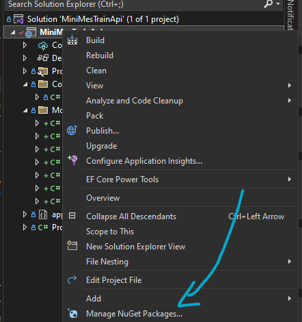
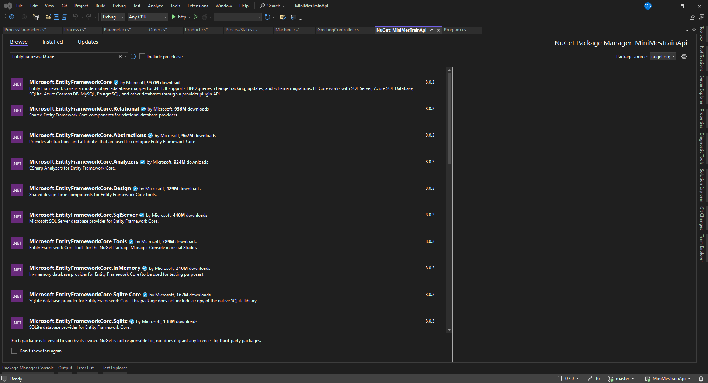
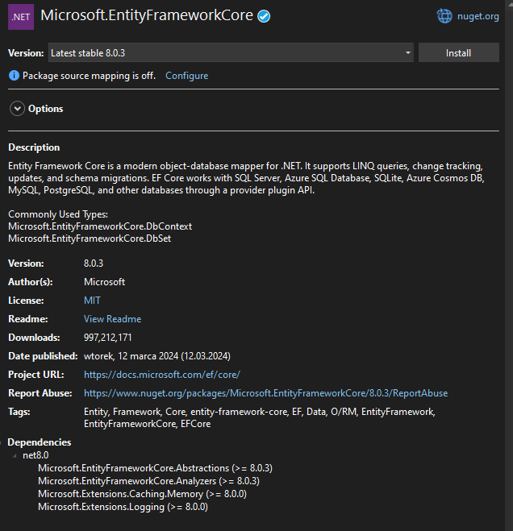
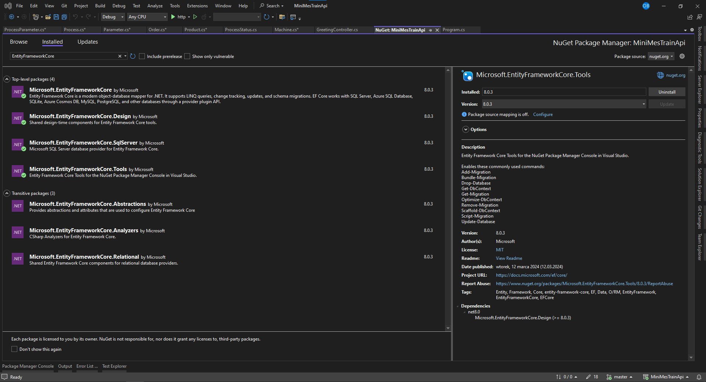
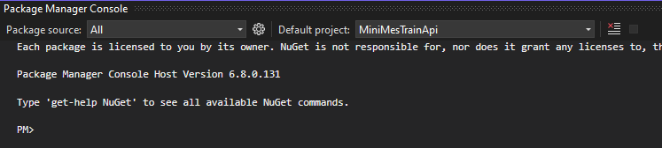
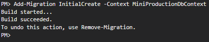
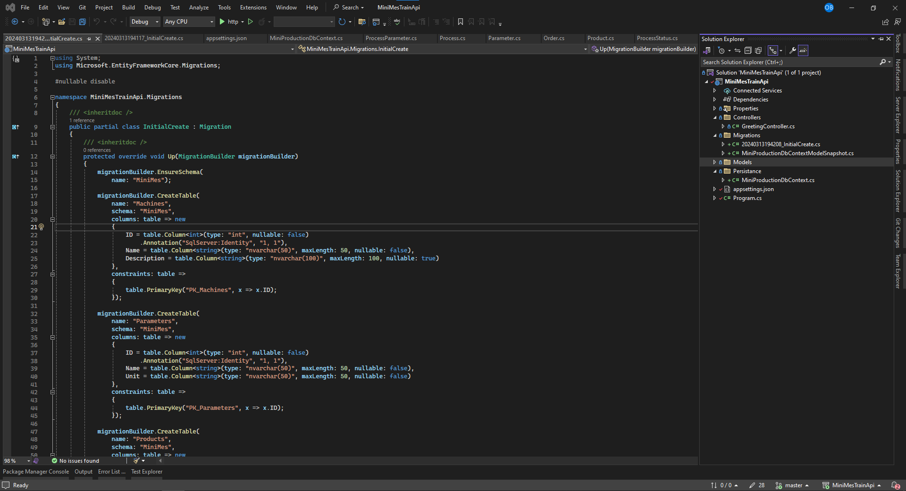
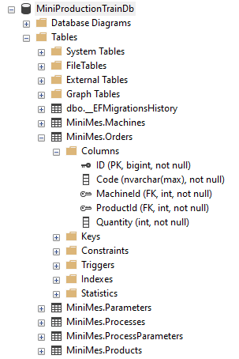

# EntityFramework

Entity Framework (EF) to otwarte narzędzie Object-Relational Mapping (ORM) dla platformy .NET, które umożliwia programistom pracę z bazami danych w sposób zorientowany obiektowo. EF pozwala na mapowanie klas w aplikacjach .NET na tabele w bazie danych, a operacje na obiektach tych klas na zapytania SQL, co znacznie upraszcza proces tworzenia, odczytu, aktualizacji i usuwania danych (CRUD).

## Główne cechy Entity Framework:
1. Abstrakcja nad bazą danych: EF zapewnia warstwę abstrakcji, która minimalizuje ilość kodu bezpośrednio związanego z bazą danych, jakiego muszą używać deweloperzy. Dzięki temu programiści mogą skupić się na logice biznesowej aplikacji zamiast na szczegółach implementacji bazy danych.

1. LINQ do Entities: EF wykorzystuje Language Integrated Query (LINQ) do zapytań, co pozwala na pisanie zapytań do bazy danych bezpośrednio w C# (lub innym języku .NET), zamiast używać SQL. LINQ jest bezpieczne typowo i zintegrowane z językiem programowania, co ułatwia pisanie zapytań i redukuje ryzyko błędów.

1. Migracje: EF umożliwia zarządzanie zmianami w schemacie bazy danych przez funkcję migracji. Migracje pozwalają na automatyczne lub manualne stosowanie zmian w schemacie bez konieczności bezpośredniej ingerencji w bazę danych, co jest przydatne w cyklu życia aplikacji.

1. Ładowanie powiązanych danych: EF oferuje różne strategie ładowania danych powiązanych z obiektami, takie jak eager loading, lazy loading i explicit loading, które pozwalają kontrolować, kiedy i jak dane powiązane są ładowane z bazy danych.

1. Wsparcie dla wielu dostawców baz danych: EF wspiera różnorodne systemy baz danych, takie jak Microsoft SQL Server, MySQL, PostgreSQL i inne, co daje elastyczność w wyborze bazy danych.

1. Modelowanie wizualne i Code First: EF pozwala na modelowanie bazy danych zarówno wizualnie (przy użyciu Entity Framework Designer), jak i programistycznie (metodą Code First), gdzie klasa .NET jest bezpośrednio mapowana na schemat bazy danych, co daje deweloperom swobodę w projektowaniu aplikacji.

## NuGet

Aby zainstalować EF Core, będziemy musieli skorzystać z manadżera pakietów `NuGet`

NuGet to menedżer pakietów dla platformy .NET, który umożliwia programistom łatwe dodawanie, aktualizowanie i usuwanie bibliotek i narzędzi w ich projektach .NET. Jest to integralna część ekosystemu .NET, która ułatwia zarządzanie zależnościami w aplikacjach i bibliotekach.

#### Kluczowe cechy NuGet:
1. Centralne Repozytorium: NuGet korzysta z centralnego repozytorium pakietów (nuget.org), które zawiera tysiące gotowych do użycia bibliotek i narzędzi opracowanych przez Microsoft oraz społeczność. Programiści mogą przeszukiwać to repozytorium, aby znaleźć pakiety, które spełniają ich potrzeby.

1. Łatwa integracja: NuGet jest ściśle zintegrowany z Visual Studio, .NET CLI i innymi popularnymi środowiskami programistycznymi, co pozwala na łatwe dodawanie, aktualizowanie i usuwanie pakietów bezpośrednio z poziomu IDE lub linii poleceń.

1. Zarządzanie zależnościami: Gdy dodajesz pakiet do projektu, NuGet automatycznie rozwiązuje i instaluje wszelkie dodatkowe zależności, które ten pakiet może wymagać, co znacznie upraszcza proces zarządzania zależnościami.

1. Wersjonowanie: NuGet wspiera wersjonowanie pakietów, co pozwala programistom na określenie, które wersje pakietów mają być używane w ich projektach. Dzięki temu można łatwo aktualizować lub cofać się do wcześniejszych wersji pakietów.

1. Pakiety prywatne i korporacyjne: Oprócz korzystania z publicznego repozytorium nuget.org, programiści i organizacje mogą tworzyć własne prywatne źródła pakietów, co jest przydatne do udostępniania i zarządzania wewnętrznymi bibliotekami w obrębie firmy.

1. Automatyczne przywracanie pakietów: Projekty korzystające z NuGet mogą automatycznie przywracać wszystkie potrzebne pakiety podczas budowania, co upraszcza współpracę w zespołach i integrację z systemami ciągłej integracji (CI/CD).

NuGet stał się standardowym sposobem na zarządzanie zależnościami w projektach .NET, ułatwiając programistom dostęp do najnowszych bibliotek i narzędzi, a także zachowanie spójności i uporządkowania w zarządzaniu pakietami w ich aplikacjach.

## Instalacja

Kliknij PPM na plik z projektem i wybierz opcję `Manage NuGet Packages...` 


Po otwarciu managera, odznacz `Inlcude prerelease` i wyszukaj:

```
EntityFrameworkCore
```



Następnie kliknij na `Microsoft.EntityFrameworkCore` i po prawej stronie wybierz wersję oznaczoną jako `Latest stable`. W moim przypadku jest to 8.0.3. Teraz możesz kliknąć `Install`



W podobny sposób zainstaluj rozszerzenia:
- Microsoft.EntityFrameworkCore.Design
- Microsoft.EntityFrameworkCore.SqlServer (lub inna preferowana BD)
- Microsoft.EntityFrameworkCore.Tools

Pakiety NuGet rozszerzające podstawowy pakiet Entity Framework Core (EF Core) zapewniają dodatkową funkcjonalność, która umożliwia lepsze zarządzanie procesem tworzenia, rozwijania i migracji baz danych w projektach .NET. Oto do czego służą wymienione przez Ciebie pakiety:

### Microsoft.EntityFrameworkCore.Design
Ten pakiet jest niezbędny do pracy z narzędziami czasu projektowania dla EF Core, które umożliwiają na przykład generowanie kodu dla klas modeli baz danych na podstawie istniejących baz danych (tzw. Reverse Engineering) oraz tworzenie i stosowanie migracji baz danych. Pakiet Microsoft.EntityFrameworkCore.Design jest wymagany do wykonania tych i innych zadań związanych z EF Core w środowisku projektowym, takich jak:

- Przygotowywanie migracji, które śledzą zmiany schematu bazy danych.
- Aktualizowanie bazy danych do nowej wersji schematu za pomocą migracji.
- Generowanie kodu modelu na podstawie istniejącej bazy danych (scaffoldowanie).

### Microsoft.EntityFrameworkCore.SqlServer
Pakiet Microsoft.EntityFrameworkCore.SqlServer jest dostawcą (Provider) bazy danych dla EF Core, który umożliwia korzystanie z Microsoft SQL Server jako systemu zarządzania bazą danych. EF Core jest zbudowany w sposób modularny, co oznacza, że różne bazy danych wymagają oddzielnych dostawców do pracy. Dostawca określa, jak EF Core komunikuje się z daną bazą danych, realizując specyfikę zapytań SQL, konwencji i zachowań charakterystycznych dla tego systemu. Pakiety dla innych baz danych (jak PostgreSQL, SQLite, MySQL) działają analogicznie, dostarczając wsparcie dla tych systemów.

### Microsoft.EntityFrameworkCore.Tools
Microsoft.EntityFrameworkCore.Tools zawiera zestaw narzędzi konsolowych dostępnych w PowerShell dla użytkowników Visual Studio oraz w .NET CLI, które wspomagają rozwój aplikacji korzystających z EF Core. Narzędzia te oferują szereg funkcji, takich jak:

- Tworzenie i zarządzanie migracjami schematu bazy danych.
- Aktualizowanie bazy danych do najnowszej migracji lub dowolnej wybranej wcześniej.
- Generowanie kodu modeli baz danych na podstawie istniejącej bazy (scaffoldowanie).

Zestawienie tych narzędzi umożliwia programistom efektywne zarządzanie cyklem życia bazy danych oraz modelu danych aplikacji, od projektowania przez rozwój, aż po produkcję. Używanie tych pakietów rozszerzających EF Core pozwala na bardziej płynne i zintegrowane doświadczenie programistyczne podczas pracy z bazami danych w projektach .NET.

Otwórz teraz zakładkę installed. Powinna ona wyglądać mniej więcej tak:


## DbContext

Za pomocą kilku kliknięć wyposażyliśmy się właśnie wpotężne narzędzie obsługi BD. Stwórzmy teraz klasę reprezentującą BD w naszym kodzie. 

`DbContext` jest kluczową klasą w Entity Framework (EF) i Entity Framework Core (EF Core), służącą jako most między kodem C# Twojej aplikacji a bazą danych. Jest to centralny punkt dla wszystkich operacji związanych z bazą danych, takich jak: zapytania, wstawianie, aktualizowanie, usuwanie danych oraz zarządzanie transakcjami.

### Główne funkcje DbContext:
1. Śledzenie Zmian: DbContext automatycznie śledzi zmiany dokonywane na obiektach pobranych z bazy danych. Dzięki temu, gdy wywołujesz metodę SaveChanges(), EF może wygenerować odpowiednie zapytania SQL, aby zaktualizować bazę danych na podstawie tych zmian.

1. Zarządzanie Połączeniami: DbContext zarządza połączeniem z bazą danych, otwierając i zamykając je w miarę potrzeb, co upraszcza zarządzanie zasobami.

1. Wykonywanie Zapytań: Dzięki DbContext, możesz używać LINQ do pisania zapytań, które są tłumaczone na zapytania SQL dopasowane do konkretnego dostawcy bazy danych.

1. Caching i Lazy Loading: DbContext oferuje caching pierwszego poziomu, co oznacza, że obiekty pobrane z bazy danych są przechowywane w kontekście i mogą być ponownie użyte bez dodatkowych zapytań do bazy. Wspiera również lazy loading, czyli leniwe ładowanie powiązanych danych na żądanie.

1. Migracje: DbContext współpracuje z systemem migracji EF Core, umożliwiającym aktualizację schematu bazy danych w sposób kontrolowany i wersjonowany.

1. Konfiguracja Modelu: DbContext pozwala na skonfigurowanie modelu danych za pomocą Fluent API lub adnotacji danych, określając takie aspekty jak relacje między tabelami, klucze obce, indeksy, ograniczenia i konwersje typów.

### MiniProductionDbContext

Dodajmy teraz fodler `Persistance` do naszego projektu i stwórzmy w nim klasę `MiniProductionDbContext.cs`. Dodajmy tam taki kod:

```c# 
public class MiniProductionDbContext : DbContext
{
    public MiniProductionDbContext(DbContextOptions options) : base(options) { }

    public virtual DbSet<Machine> Machines { get; set; } = null!;
    public virtual DbSet<Product> Products { get; set; } = null!;
    public virtual DbSet<Order> Orders { get; set; } = null!;
    public virtual DbSet<Process> Processes { get; set; } = null!;
    public virtual DbSet<ProcessParameter> ProcessParameters { get; set; } = null!;
    public virtual DbSet<Parameter> Parameters { get; set; } = null!;

    protected override void OnModelCreating(ModelBuilder modelBuilder)
    {
        modelBuilder.Entity<Machine>(entity =>
        {
            entity.ToTable("Machines", "MiniMes");

            entity.Property(e => e.Id).HasColumnName("ID");

            entity.Property(e => e.Description).HasMaxLength(100);

            entity.Property(e => e.Name).HasMaxLength(50);
        });
    }
}
```

### Konstruktor
`MiniProductionDbContext(DbContextOptions options) : base(options) {}` Konstruktor klasy przyjmuje obiekt `DbContextOptions`, który zawiera konfigurację dla kontekstu, taką jak typ bazy danych do użycia, string połączeniowy itp. Konstruktor przekazuje te opcje do konstruktora bazowego klasy `DbContext`.
### DbSets
Właściwości typu `DbSet<T>` reprezentują kolekcje encji, które odpowiadają tabelom w bazie danych. Każda z tych właściwości umożliwia wykonywanie operacji CRUD (Create, Read, Update, Delete) na danych zawartych w odpowiednich tabelach. W tym przypadku mamy:
- Machines: Kolekcja encji typu Machine, reprezentująca maszyny w systemie produkcji.
- Products: Kolekcja encji typu Product, reprezentująca produkty.
- Orders: Kolekcja encji typu Order, reprezentująca zamówienia.
- Processes: Kolekcja encji typu Process, reprezentująca procesy produkcyjne.
- ProcessParameters: Kolekcja encji typu ProcessParameter, reprezentująca parametry procesów.
- Parameters: Kolekcja encji typu Parameter, reprezentująca parametry w systemie.
### OnModelCreating
- Metoda `OnModelCreating(ModelBuilder modelBuilder)` jest używana do konfiguracji modelu przy użyciu Fluent API. Pozwala to na dokładne zdefiniowanie, jak encje są mapowane na tabele i kolumny w bazie danych, definiowanie relacji między tabelami, konfiguracje kluczy głównych, indeksów, ograniczeń itp.
- W zaprezentowanym przykładzie konfiguracja dotyczy encji Machine, gdzie określono nazwę tabeli ("Machines"), schemat ("MiniMes"), długość maksymalną dla kolumn Description i Name oraz nazwę kolumny dla Id.

### Konfiguracja relacji

Dodajmy teraz konfiugurację relacji dla `Orders`
```c#
modelBuilder.Entity<Order>(entity =>
{
    entity.ToTable("Orders", "MiniMes");

    entity.Property(e => e.Id).HasColumnName("ID");

    entity.HasOne(d => d.Machine)
        .WithMany(p => p.Orders)
        .HasForeignKey(d => d.MachineId);

    entity.HasOne(d => d.Product)
        .WithMany(p => p.Orders)
        .HasForeignKey(d => d.ProductId);
});
```

Konfiguracja relacji między encjami w Entity Framework Core (EF Core) przy użyciu Fluent API pozwala na szczegółowe określenie, jak encje są powiązane w bazie danych, włącznie z definiowaniem kluczy obcych, właściwości nawigacyjnych i zachowań kaskadowych.

#### Ustawienie Tabeli i Kolumn
```c#
entity.ToTable("Orders", "MiniMes");
entity.Property(e => e.Id).HasColumnName("ID");
```
- entity.ToTable("Orders", "MiniMes"); określa, że encja Order ma być mapowana na tabelę Orders w schemacie MiniMes bazy danych.
- entity.Property(e => e.Id).HasColumnName("ID"); wskazuje, że właściwość Id w klasie Order odpowiada kolumnie ID w tabeli Orders.

#### Konfiguracja Relacji
Relacje są skonfigurowane za pomocą metod HasOne i WithMany, które definiują relacje jeden do wielu między Order a Machine oraz Order a Product:
```c#
entity.HasOne(d => d.Machine)
    .WithMany(p => p.Orders)
    .HasForeignKey(d => d.MachineId);

entity.HasOne(d => d.Product)
    .WithMany(p => p.Orders)
    .HasForeignKey(d => d.ProductId);
```
- entity.HasOne(d => d.Machine).WithMany(p => p.Orders).HasForeignKey(d => d.MachineId); określa, że każdy Order ma dokładnie jedną Machine (relacja jeden do jednego), ale każda Machine może być powiązana z wieloma Orders (relacja jeden do wielu). Wskazuje również, że MachineId w Order jest kluczem obcym, który łączy te dwie encje.

- Analogicznie, entity.HasOne(d => d.Product).WithMany(p => p.Orders).HasForeignKey(d => d.ProductId); definiuje relację jeden do jednego między Order a Product, gdzie ProductId jest kluczem obcym.

### Reszta modeli

Skonfiguruj teraz analogicznie resztę modeli BD.

## ConnectionString

ConnectionString to ciąg tekstowy używany do definiowania informacji potrzebnych do nawiązania połączenia z bazą danych z aplikacji. Jest to podstawowy sposób, w jaki aplikacje uzyskują dostęp do baz danych, i zawiera on kluczowe szczegóły konieczne do zainicjowania połączenia, takie jak typ serwera baz danych, nazwa bazy danych, dane uwierzytelniające (login i hasło) oraz inne parametry specyficzne dla połączenia.

### Składniki ConnectionString
ConnectionString może zawierać różne elementy w zależności od typu i wymagań bazy danych, z którą aplikacja ma się połączyć. Oto kilka typowych elementów znajdujących się w ConnectionString:

- Provider: Określa rodzaj bazy danych lub bibliotekę używaną do połączenia, np. SQL Server, MySQL, Oracle itp.
- Data Source (lub Server, Host): Nazwa serwera lub ścieżka do bazy danych. Może to być nazwa domenowa, adres IP serwera bazy danych lub ścieżka do pliku bazy danych.
- Database: Nazwa bazy danych, do której ma zostać nawiązane połączenie.
- User ID i Password: Dane logowania potrzebne do uwierzytelnienia w bazie danych (w przypadku połączeń wymagających uwierzytelnienia).
- Integrated Security: Określa, czy połączenie powinno używać mechanizmu bezpieczeństwa zintegrowanego z systemem operacyjnym (np. uwierzytelnianie Windows).
- Other parameters: Inne parametry, które mogą być potrzebne, takie jak timeouty połączenia, czy połączenie jest szyfrowane, ustawienia pooling'u połączeń itp.

### Gdzie jest przechowywany ConnectionString
ConnectionString jest zazwyczaj przechowywany w plikach konfiguracyjnych aplikacji, takich jak appsettings.json w projektach .NET Core lub web.config/app.config w starszych aplikacjach .NET Framework. Przechowywanie ConnectionString w plikach konfiguracyjnych umożliwia łatwą zmianę szczegółów połączenia bez konieczności rekompilacji aplikacji, a także umożliwia oddzielenie poufnych danych uwierzytelniających od kodu źródłowego.

### Bezpieczeństwo
Ważne jest, aby chronić poufne informacje zawarte w ConnectionString, szczególnie dane uwierzytelniające, przed nieautoryzowanym dostępem. Można to osiągnąć poprzez zastosowanie odpowiednich mechanizmów szyfrowania dla plików konfiguracyjnych lub korzystanie z bezpieczniejszych metod uwierzytelniania, takich jak uwierzytelnianie zintegrowane lub zarządzanie tożsamościami i dostępem w chmurze.

### Konfiguracja

Skonfigurujmy teraz więc informacje na temat dostępu do BD. W przypadku SQLServer bedzie to wyglądać na przykład tak:

```
"Data Source = localhost; Initial Catalog = MiniProductionTrainDb; Persist Security Info=True; Integrated Security=SSPI; Connection Timeout = 15; TrustServerCertificate=True;"
```

#### DataSource
Oczywiście DataSource oraz dane do logowania użytkownika mogą się różnić w zależności od specyficznych konfiguracji BD. Podobnie, ConnectionString może się różnić dla różnych Provider'ów BD. Np w SQLite argumetn DataSource będzie po prostu ścieżką do pliku.db.

W podanym przeze mnie przykładzie wskazuję że serwerem SQL jest po prostu localhost, ponieważ mam zainstalowany SQL Server bezpośrednio na systemie w którym programuję. Może się tam pojawić oczywiście IP serwera lub nazwa instancji SQL Server.

#### Authentication
Dodatkowo wskazałem poprzez `Persist Security Info=True; Integrated Security=SSPI;`, że sposobem logowania do Serwera jest `WindowsAuthentication`. Można to było wskazać również poprzez `Trusted_Connection=True;`. Ten sposób autoryzacji używa obecnego konta użytkownika systemu Windows do uwierzytelnienia z bazą danych SQL Server. Nie wymaga jawnego podawania nazwy użytkownika i hasła w ConnectionString, co jest uważane za bezpieczniejsze rozwiązanie, ponieważ unika się przechowywania poufnych danych uwierzytelniających w aplikacji.

Istnieje również `SQL Server Authentication`, które wymaga podania konkretnej nazwy użytkownika i hasła, które są zdefiniowane w SQL Server. Ta metoda uwierzytelniania nie korzysta z kont użytkowników systemu Windows, ale z kont zdefiniowanych bezpośrednio w SQL Server. Jest to przydatne w środowiskach, gdzie nie można używać uwierzytelniania Windows, np. w aplikacjach internetowych dostępnych publicznie lub gdy aplikacja musi mieć dostęp do bazy danych znajdującej się na innym serwerze, niezarządzanym przez system Windows.

### Appsettings

No dobrze wiemy juz jak skonfigurować ciąg znaków informujący EF o sposobie dostępu do BD. Jak zatem przekazać te informacje do EF? Wróćmy do drugiego pliku, który powinien zostać w bazowym projekcie razem z plikiem `Program.cs` czyli `appsettings.json`. Jego zawartość powinna wyglądać następująco:

```json
{
  "Logging": {
    "LogLevel": {
      "Default": "Information",
      "Microsoft.AspNetCore": "Warning"
    }
  },
  "AllowedHosts": "*"
}
```

Jest to domyślna zawartość tego pliku tworzona przy kreowaniu projektu. Apliakcja ASP.NET bazowo wspiera kilka podstawowych najczęściej używanych konfiguracji. Jedną z nich jest `ConnectionStrings`. Dodajmy więc naszą konfigurację. Przy okazji możemy również skonfigurować port naszej aplikacji tak, aby zawsze byłtaki jak chcemy. Możemy zrobić to za pomocą bazowych ustawień `Kestrel`

```json
{
  "Logging": {
    "LogLevel": {
      "Default": "Information",
      "Microsoft.AspNetCore": "Warning"
    }
  },
  "AllowedHosts": "*",

  "ConnectionStrings": {
    "MiniProduction": "Data Source = localhost; Initial Catalog = MiniProductionTrainDb; Persist Security Info=True; Integrated Security=SSPI; Connection Timeout = 15; TrustServerCertificate=True;"
  }
},

  "Kestrel": {
    "EndPoints": {
      "Http": {
        "Url": "http://localhost:5001"
      }
    }
  }
```

### Wykorzystanie AppSettings

Mamy jużskonfigurowany plik `appsettings.json`, pora z niego skorzystać w kodzie. Wróćmy do miejsca gdzie budowana jest nasza aplikacja, czyli do `Program.cs`. Nie przejmujac się w tym momencie dlaczego tak, a nie inaczej dodaj do Service'ów (zarejestruj) nasz wcześniej utworzony dbContext korzystając z Configuration, w celu wyciągnięcia ConnectionStringa z `appsettings.json`.

```c#

using Microsoft.EntityFrameworkCore;
using MiniMesTrainApi.Persistance;

namespace MiniMesTrainApi
{
    public class Program
    {
        public static void Main(string[] args)
        {
            var builder = WebApplication.CreateBuilder(args);

            // Add services to the container.

            builder.Services.AddControllers();
            // Learn more about configuring Swagger/OpenAPI at https://aka.ms/aspnetcore/swashbuckle
            builder.Services.AddEndpointsApiExplorer();
            builder.Services.AddSwaggerGen();

            string? connString = builder.Configuration.GetConnectionString("MiniProduction");
            if (connString == null)
            {
                Console.WriteLine("There is no ConnectionString called MiniProduction in appsettings.json");
            }
            else
            {
                builder.Services.AddDbContext<MiniProductionDbContext>(options => options.UseSqlServer(connString));
            }

            var app = builder.Build();

            // Configure the HTTP request pipeline.
            if (app.Environment.IsDevelopment())
            {
                app.UseSwagger();
                app.UseSwaggerUI();
            }

            app.UseAuthorization();

            app.MapControllers();

            app.Run();
        }
    }
}
```

Rejestracja i konfiguracja DbContext w ASP.NET Core odbywa się podczas budowania hosta aplikacji, co jest kluczowym momentem, gdy aplikacja konfiguruje swoje zależności i usługi, z których będzie korzystać. DbContext jest zarejestrowany w kontenerze usług aplikacji za pomocą wbudowanego systemu wstrzykiwania zależności (Dependency Injection - DI). 

`AddDbContext` jest wywołaniem metody rozszerzenia `AddDbContext<TContext>`, gdzie `TContext` to typ kontekstu bazy danych (MiniProductionDbContext w tym przypadku). Metoda ta rejestruje kontekst bazy danych jako usługę w kontenerze DI, co umożliwia jego późniejsze wstrzyknięcie do innych części aplikacji (np. do kontrolerów).

`options => options.UseSqlServer(connString)` to wyrażenie lambda, które konfiguruje opcje dla DbContext poprzez użycie dostawcy bazy danych SQL Server. W tym miejscu, `options.UseSqlServer` jest metodą rozszerzenia określającą, że DbContext powinien używać SQL Server jako systemu zarządzania bazą danych. Metoda ta przyjmuje `connString`, który jest łańcuchem połączenia określającym, jak nawiązać połączenie z bazą danych.

## Tworzenie migracji

Mamy już wszystko skonfigurowane. Można wreszcie rozpocząć tworzenie BD za pomocą podejścia CodeFirst. Zacznijmy od wygenerowania migracji.

Migracje w EF to mechanizm, który umożliwia deweloperom zarządzanie zmianami w modelu danych aplikacji i odzwierciedlanie tych zmian w schemacie bazy danych bez utraty danych. Migracje pozwalają na ewolucję bazy danych w miarę rozwoju aplikacji, zapewniając przy tym bezpieczne i kontrolowane wprowadzanie zmian.

### Jak działają migracje EF?
1. Tworzenie migracji: Kiedy model danych aplikacji zostaje zmodyfikowany (np. poprzez dodanie, usunięcie lub zmianę właściwości encji), deweloper generuje migrację używając narzędzi EF. Narzędzia te analizują różnice między aktualnym stanem modelu danych a stanem bazy danych, a następnie generują kod migracji, który odzwierciedla te zmiany.

1. Kod migracji: Wygenerowany kod migracji zawiera instrukcje, które są potrzebne do zmodyfikowania schematu bazy danych tak, aby pasował do zaktualizowanego modelu danych. Kod ten jest zapisywany w klasach migracji, które mogą być następnie edytowane przez programistów, jeśli jest taka potrzeba.

1. Stosowanie migracji: Po wygenerowaniu i ewentualnym dostosowaniu kodu migracji, deweloper aplikuje migrację do bazy danych. EF używa kodu migracji do wykonania odpowiednich zmian w bazie danych, takich jak tworzenie lub usuwanie tabel, kolumn, indeksów itd.

1. Historia migracji: EF utrzymuje historię stosowanych migracji w specjalnej tabeli w bazie danych. Dzięki temu EF wie, które migracje zostały zastosowane i może stosować nowe migracje w odpowiedniej kolejności.

### Zalety używania migracji EF:
- Kontrolowane zmiany w schemacie: Migracje pozwalają na bezpieczne wprowadzanie zmian w schemacie bazy danych, minimalizując ryzyko utraty danych.
- Wersjonowanie schematu bazy danych: Historia migracji działa jak system kontroli wersji dla schematu bazy danych, co ułatwia zarządzanie zmianami i współpracę w zespole.
- Automatyzacja: Proces migracji może być zautomatyzowany w ramach procesu budowania i wdrażania aplikacji, co ułatwia ciągłą integrację i dostarczanie.
- Środowiska deweloperskie i produkcyjne: Migracje ułatwiają synchronizację zmian schematu bazy danych między środowiskami deweloperskimi, testowymi i produkcyjnymi.
- Migracje w EF to potężne narzędzie, które pomaga zarządzać cyklem życia bazy danych aplikacji, zapewniając jednocześnie, że zmiany w modelu danych są bezpiecznie i efektywnie odzwierciedlane w bazie danych.

### Package Manager Console

Otwórzmy teraz PackageManager w VS. Najprawdopodobniej trzeba będzie go wyszukać u góry aplikacji. Powinien się wyświetlić w takiej postaci:


Wprowadźmy taką komendę:

```
Add-Migration InitialCreate -Context MiniProductionDbContext
```

`Uwaga!` Jeśli VS rzuca błędem odnośnie braku referencji do pakietu EFCore.Design, wystarczy wykonać 'rebuild' apliakcji (PPM na projekt -> Rebuild) oraz nie zaszkodzi wyłączyć i włączyć VS.



Zauważ, że automatycznie został wygenerowany plik z migracją i dodany do automatycznie stworzonego folderu `Migrations`:



Migracja zapewnia nam wykonanie odpowiednich skryptów SQL w celu zbudowania BD. Samo stworzenie pliku z migracją jeszcze nie egzekwuje jej wykonania. Aby stworzyć BD (lub zmodyfikować istniejącą), musimy wykonać kolejną komendę:

```
Update-Database
```

`Uwaga!` Jeśli widzisz błąd `Only the invariant culture is supported in globalization-invariant mode. See https://aka.ms/GlobalizationInvariantMode for more information. (Parameter 'name')`, wystarczy wejść w plik projektu .csproj i usunąć linijkę `<InvariantGlobalization>true</InvariantGlobalization>`

Jeśli wszystko przebiegło pomyślnie, w konsoli zobaczysz szybko generujący się tekst skryptów SQL które właśnie się wykonały na Twojej BD. Możesz teraz odświeżyć serwer SQL i zobaczyć świeżo utworzoną BD oraz tabele i kolumny, które wcześniej zdefiniowaliśmy w kodzie w C#.

 

W ten sposób stworzyliśmy Bazę Danych, w całości konfigurując ją po stronie kodu (stąd nazwa podejścia CodeFirst). Ani na chwilę w tym procesie, nie musieliśmy otwierać serwera SQL. 